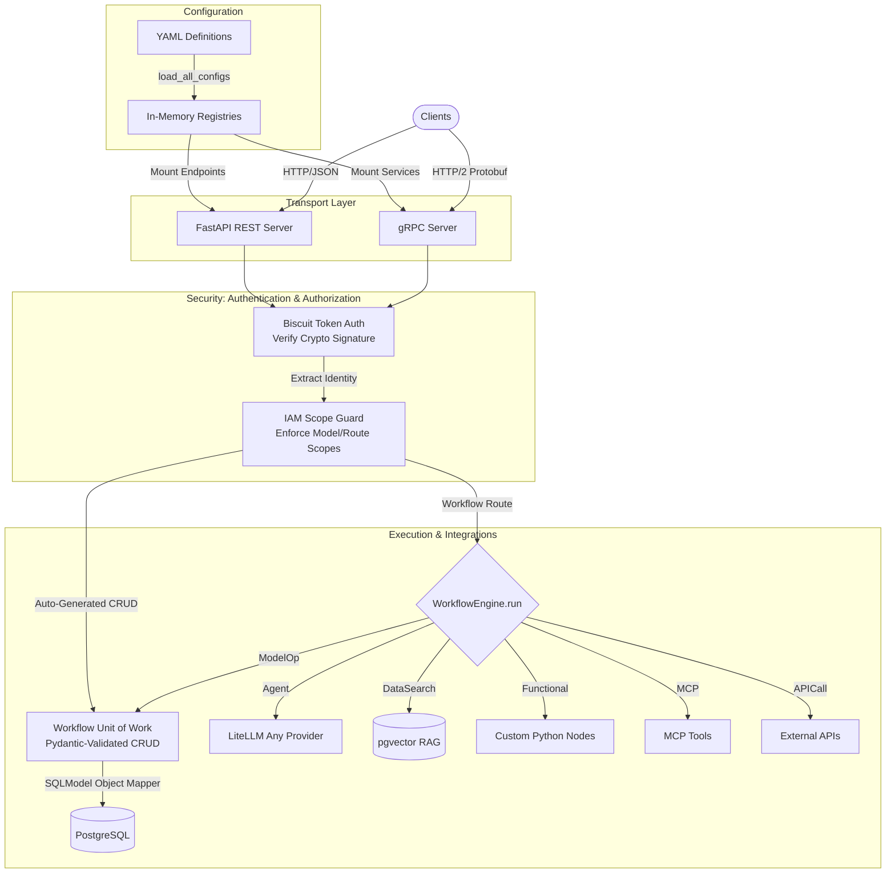
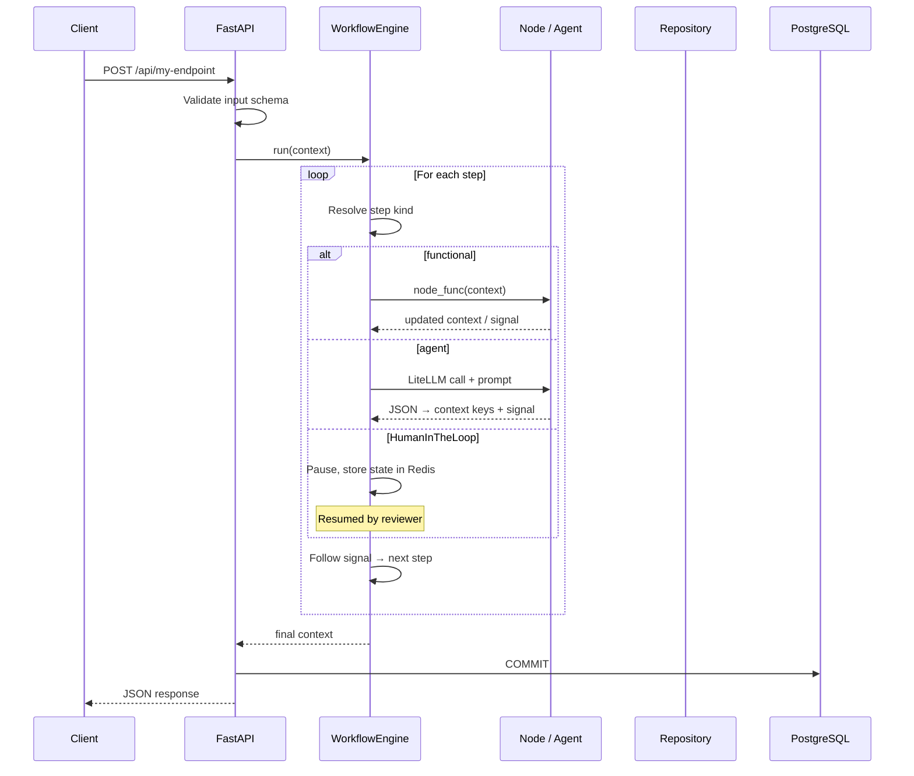

# Architecture

Understanding how tuvl components work together.

## Design Philosophy

tuvl follows four core principles:

1. **Local-First** — every component runs on your infrastructure; no cloud dependency required
2. **YAML-Driven** — business logic lives in version-controlled YAML, not scattered across controller code
3. **AI is a step, not the system** — LLM calls are first-class workflow steps alongside Python functions, HTTP calls, and MCP tools
4. **Auditable by default** — every execution emits structured step events with signals, snapshots, and timings

## System Overview



## Core Components

### gRPC-Web Layer

All real-time and developer tooling traffic uses [gRPC-Web](https://github.com/grpc/grpc/blob/master/doc/PROTOCOL-WEB.md) via [sonora](https://github.com/public-apis/sonora) — a pure-ASGI gRPC-Web server that runs inside the same FastAPI process.

Three servicers are registered under the `/grpc/` mount:

| Servicer | Proto | Responsibility |
|---|---|---|
| `ExecutionServicer` | `execution.proto` | Streaming workflow execution events |
| `IamServicer` | `iam.proto` | User/role/scope management, token lifecycle |
| `DevServicer` | `dev.proto` | Dev portal: file CRUD, Lens, Spectrum, AI chat |

`DevServicer` is only active when `TUVL_DEV_MODE=true`. In production it is not registered and the `/grpc/dev.*` routes do not exist.

Clients use `@protobuf-ts/grpcweb-transport` (browser and Node.js). Both the tuvl insight developer portal and the `@tuvl/client` SDK speak gRPC-Web.

### Workflow Engine

`WorkflowEngine` (and its subclass `WorkflowTestRunner` for testing) is the orchestrator. For each request it:

1. Deserialises the workflow YAML into step configs
2. Maintains the mutable context dictionary throughout execution
3. Resolves the next step via signal-based routing after every step
4. Delegates to the appropriate step runner (Functional / Agent / APICall / MCP / HumanInTheLoop / ModelOp / Response)
5. Emits an OTel span per step when a tracer is configured

### Node Registry

A global mapping of node names → async Python functions:

```python
from tuvl.core.nodes.base import node, NODE_REGISTRY

@node("my_node")
async def my_node(ctx: dict) -> dict:
    return ctx

# NODE_REGISTRY["my_node"] is now set
```

Nodes must be importable at process startup. The engine loads all Python files from the project's `nodes/` directory automatically.

### Model Registry

Dynamic SQLModel classes generated from YAML `ModelDefinition` files at startup. Each registered model also produces auto-generated CRUD routes at `/api/{model_name}`.

### Repository Pattern

`BaseRepository[T]` provides a clean async data-access layer backed by SQLAlchemy:

```python
from tuvl.core.repositories.registry import get_repository

repo = get_repository("Contact", ctx["_session"])
contact = await repo.add({"email": "...", "name": "..."})
```

See [Repositories](repositories.md) for the full API.

### Human-in-the-Loop (HITL)

The `HumanInTheLoop` step kind pauses execution and stores state in Redis. A reviewer approves or rejects via the API (or the tuvl insight UI), after which the engine resumes exactly where it stopped. Timeouts are configurable per step.

### OpenTelemetry

Every step emits a span with `signal`, `duration_ms`, and context attributes when `TUVL_TELEMETRY_ENABLED=true`. Configure the OTLP exporter in `.tuvl/telemetry.yaml`. See [Telemetry](../configuration/telemetry.md).

## Request Flow



## Step Kinds

| Kind | Description |
|------|-------------|
| `Functional` | Call a registered Python node from `NODE_REGISTRY` |
| `Agent` | LLM call via LiteLLM; structured JSON output maps to context keys |
| `APICall` | Outbound HTTP request; response mapped into context |
| `MCP` | Invoke a tool on an MCP server (stdio or SSE) |
| `HumanInTheLoop` | Pause execution; await a human approve/reject decision |
| `ModelOp` | Direct CRUD operation on a registered data model |
| `Router` | Evaluate a condition expression; branch via signal |
| `Response` | Shape and emit the final HTTP response from context keys |

## Context Keys

All engine-injected keys begin with `_` and are stripped from HTTP responses:

| Key | Set by | Description |
|-----|--------|-------------|
| `_session` | Engine | `AsyncSession` for the current request |
| `_db` | Engine | Unit-of-work repository accessor |
| `_user_id` | Auth middleware | Authenticated user ID |
| `_last_error` | Engine | Last step error string |
| `_api_status_code` | `APICall` step | HTTP status of last outbound call |
| `_response` | `Response` step | Shaped payload returned to client |

## Next Steps

- [Workflows](workflows.md) — Step-by-step workflow configuration
- [Nodes](nodes.md) — Building custom node functions
- [Context Object](context.md) — The context lifecycle in detail
