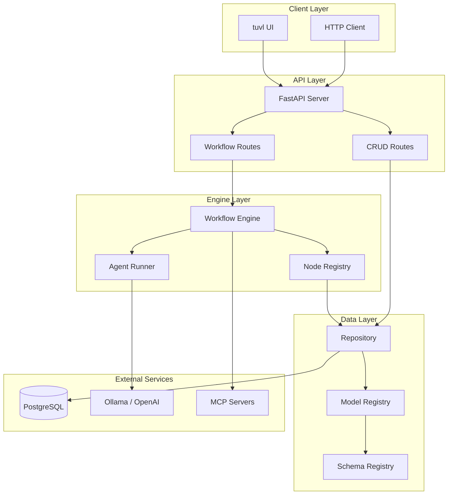
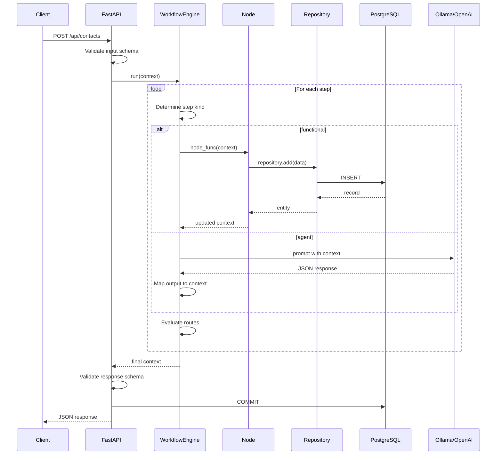

# Architecture

Understanding how tuvl components work together.

## Design Philosophy

tuvl follows several key architectural principles:

1. **Local-First** — All services can run on your infrastructure
2. **YAML-Driven** — Configuration over code for business logic
3. **LLM as a Function** — AI is just another step in your workflow
4. **Safe Side Effects** — LLMs generate intents, Python executes them

## System Overview



## Core Components

### Workflow Engine

The `WorkflowEngine` is the orchestrator. It:

1. Parses workflow YAML configuration
2. Maintains step execution order and routing
3. Manages the context object through each step
4. Handles errors and routing signals

```python
class WorkflowEngine:
    def __init__(self, workflow_yaml: dict) -> None:
        self.name = workflow_yaml["metadata"]["name"]
        self.steps = workflow_yaml.get("steps", [])
        
    async def run(self, context: dict[str, Any]) -> dict[str, Any]:
        # Execute steps sequentially, following routes
        ...
```

### Node Registry

A global registry mapping node names to async Python functions:

```python
NODE_REGISTRY: dict[str, Callable[..., Coroutine]] = {}

def node(name: str) -> Callable:
    """Decorator to register a node function."""
    def decorator(func: Callable) -> Callable:
        NODE_REGISTRY[name] = func
        return func
    return decorator
```

### Model Registry

Dynamic SQLModel classes generated from YAML definitions:

```python
MODEL_REGISTRY: Dict[str, Type[SQLModel]] = {}

def load_all_models(config_dir: Path) -> None:
    """Load all .yaml files and generate SQLModel classes."""
    for yaml_file in config_dir.glob("*.yaml"):
        schema = yaml.safe_load(yaml_file.read_text())
        model_class = create_sqlmodel_class(schema)
        MODEL_REGISTRY[schema["metadata"]["name"]] = model_class
```

### Schema Registry

Pydantic schemas for API validation:

```python
SCHEMA_REGISTRY: Dict[str, Dict[str, Type[BaseModel]]] = {}

# Example entry:
# {
#   "Contact": {
#     "create": ContactCreate,
#     "read": ContactRead,
#     "update": ContactUpdate
#   }
# }
```

### Repository Pattern

Generic data access layer for all models:

```python
class BaseRepository(Generic[T]):
    def __init__(self, model_name: str, session: AsyncSession):
        self.model_class = MODEL_REGISTRY[model_name]
        self.session = session
    
    async def add(self, data: dict) -> T: ...
    async def get(self, ident: Any) -> Optional[T]: ...
    async def list(self, criteria: dict) -> List[T]: ...
    async def update(self, ident: Any, data: dict) -> Optional[T]: ...
    async def remove(self, ident: Any) -> bool: ...
```

## Request Flow

Here's what happens when a workflow endpoint receives a request:



## Step Kinds

The workflow engine supports multiple step kinds:

| Kind | Description | Execution |
|------|-------------|-----------|
| `functional` | Python node function | `NODE_REGISTRY[runner](context)` |
| `agent` | LLM-powered step | Calls LLM via LiteLLM, parses JSON |
| `router` | Conditional branching | Evaluates expressions, returns signal |
| `api_call` | External HTTP request | Makes HTTP call, maps response |
| `mcp` | MCP server tool call | Invokes MCP server tool |

## Context Object

The context is a mutable dictionary that flows through every step:

```python
context = {
    # User input
    "email": "jane@example.com",
    "name": "Jane Doe",
    
    # Engine-injected
    "_session": AsyncSession,  # Database session
    
    # Step outputs
    "id": "uuid...",           # From save step
    "priority": "high",        # From AI step
    
    # Error tracking
    "_last_error": "...",      # Set on error
}
```

!!! note "Underscore Convention"
    Keys starting with `_` are internal and excluded from API responses.

## Transaction Management

The workflow manager handles database transactions:

```python
async def _run_engine(wf_name, config, context, session):
    try:
        engine = WorkflowEngine(config)
        final_context = await engine.run(context)
        await session.commit()  # Commit on success
        return JSONResponse(...)
    except Exception:
        await session.rollback()  # Rollback on failure
        return JSONResponse(status_code=500, ...)
```

This ensures atomicity — either all database operations succeed, or none do.

## Plugin Architecture

### Custom Nodes

Extend functionality by registering Python functions:

```python
@node("send_email")
async def send_email(ctx: dict[str, Any]) -> dict[str, Any]:
    # Your email logic
    return ctx
```

### MCP Servers

Integrate external tools via Model Context Protocol:

```yaml
- id: "search_files"
  kind: "mcp"
  mcp:
    server: "file-search"
    tool: "search"
    arguments:
      query: "{{ search_term }}"
```

### Custom Step Kinds

The engine is extensible for new step kinds (advanced use).

## Performance Considerations

- **Async I/O** — All operations are async for high concurrency
- **Connection Pooling** — PostgreSQL connections are pooled
- **Lazy Loading** — Models and workflows load on startup
- **Streaming** — Agent responses can be streamed (future)

## Next Steps

- [Workflows](workflows.md) — Deep dive into workflow configuration
- [Nodes](nodes.md) — Building custom node functions
- [Context Object](context.md) — Understanding the context lifecycle
