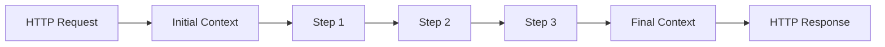

# Context Object

The context is a mutable dictionary that flows through every step of a workflow.

## Overview

When a workflow is triggered, the request body becomes the initial context. Each step can read from and write to this context, passing data to subsequent steps.



## Initial Context

The request body is merged with engine-injected values:

```python
# From HTTP POST body
{
    "email": "jane@example.com",
    "name": "Jane Doe",
    "company": "Acme Inc"
}

# After engine injection
{
    "email": "jane@example.com",
    "name": "Jane Doe", 
    "company": "Acme Inc",
    "_session": AsyncSession,  # Database session
}
```

## Modifying Context

Nodes receive and return the context:

```python
@node("enrich")
async def enrich(ctx: dict[str, Any]) -> dict[str, Any]:
    # Read from context
    email = ctx["email"]
    
    # Write to context
    ctx["domain"] = email.split("@")[1]
    ctx["status"] = "enriched"
    
    return ctx
```

## Reserved Keys

Keys starting with underscore (`_`) are reserved for internal use:

| Key | Description |
|-----|-------------|
| `_session` | SQLAlchemy async session |
| `_last_error` | Error message from failed step |
| `_workflow_name` | Name of executing workflow |

!!! warning "Private Keys"
    Never store user data in keys starting with `_`. They are stripped from API responses.

## Context in Agent Steps

Agent prompts access context via Jinja2 templates:

```yaml
- id: "classify"
  kind: "agent"
  agent:
    prompt: |
      Customer: {{ name }}
      Company: {{ company }}
      Email domain: {{ domain }}
      
      Classify this lead's potential.
    output:
      map:
        potential: lead_potential  # Write back to context
```

## Context Flow Example

```yaml
# Workflow: lead_processing
steps:
  - id: "save"
    runner: "save_lead"
    # Input: {email, name, company}
    # Output: {email, name, company, id, created_at}

  - id: "classify"
    kind: "agent"
    # Input: {email, name, company, id, created_at, _session}
    # Output: {email, name, company, id, created_at, lead_score, _session}

  - id: "route"
    kind: "router"
    # Input: {email, name, company, id, created_at, lead_score, _session}
    # Returns signal based on lead_score
```

## Accessing Context in Code

### In Functional Nodes

```python
@node("process")
async def process(ctx: dict[str, Any]) -> dict[str, Any]:
    # Required field
    email = ctx["email"]
    
    # Optional field with default
    priority = ctx.get("priority", "normal")
    
    # Check existence
    if "phone" in ctx:
        send_sms(ctx["phone"])
    
    return ctx
```

### In Router Conditions

```yaml
- id: "check_priority"
  kind: "router"
  router:
    conditions:
      - if: "priority == 'urgent'"
        signal: "escalate"
      - if: "lead_score > 80"
        signal: "high_value"
      - else: true
        signal: "normal"
```

## Context Scoping

### Request Scope

Each workflow invocation has its own context:

```
Request A → Context A
Request B → Context B
```

Contexts are isolated — changes in one request don't affect others.

### Step Scope

Context persists across steps within a single workflow:

```python
# Step 1
ctx["computed_value"] = expensive_calculation()

# Step 2 - can access Step 1's output
result = ctx["computed_value"]  # Available
```

## Best Practices

### 1. Use Meaningful Keys

```python
# Good
ctx["customer_id"] = customer.id
ctx["order_total"] = calculate_total(items)
ctx["shipping_address"] = address

# Avoid
ctx["x"] = customer.id
ctx["val"] = calculate_total(items)
```

### 2. Prefix by Source

Group related keys with prefixes:

```python
# AI-generated values
ctx["ai_classification"] = response["category"]
ctx["ai_confidence"] = response["confidence"]

# External API data
ctx["api_weather_temp"] = weather["temperature"]
ctx["api_weather_conditions"] = weather["conditions"]
```

### 3. Don't Overwrite Input

Preserve original values:

```python
# Good - new key
ctx["normalized_email"] = ctx["email"].lower()

# Risky - overwrites input
ctx["email"] = ctx["email"].lower()
```

### 4. Handle Missing Keys

```python
# Good - with fallback
name = ctx.get("name", "Unknown")

# Good - explicit check
if "phone" not in ctx:
    return ctx, "missing_phone"

# Risky - might raise KeyError
name = ctx["name"]
```

### 5. Clean Up Temporary Data

Remove intermediate values before returning:

```python
@node("finalize")
async def finalize(ctx: dict[str, Any]) -> dict[str, Any]:
    # Remove temporary keys
    ctx.pop("_temp_calculation", None)
    ctx.pop("_intermediate_result", None)
    
    return ctx
```

## Response Filtering

The workflow manager automatically filters the response:

```python
# Context at end of workflow
{
    "email": "jane@example.com",
    "name": "Jane Doe",
    "id": "uuid...",
    "_session": AsyncSession,      # ← Removed
    "_last_error": None,           # ← Removed
}

# API response
{
    "success": true,
    "data": {
        "email": "jane@example.com",
        "name": "Jane Doe",
        "id": "uuid..."
    }
}
```

## Debugging Context

Log context at each step:

```python
import logging

logger = logging.getLogger(__name__)

@node("debug_step")
async def debug_step(ctx: dict[str, Any]) -> dict[str, Any]:
    # Log non-private keys
    public_ctx = {k: v for k, v in ctx.items() if not k.startswith("_")}
    logger.debug(f"Context: {public_ctx}")
    return ctx
```

## Type Hints

For better IDE support, use TypedDict (optional):

```python
from typing import TypedDict, Any

class LeadContext(TypedDict, total=False):
    email: str
    name: str
    company: str
    id: str
    lead_score: int
    _session: Any

@node("process_lead")
async def process_lead(ctx: LeadContext) -> LeadContext:
    # IDE knows ctx has email, name, etc.
    ctx["lead_score"] = calculate_score(ctx["email"])
    return ctx
```

## Next Steps

- [Nodes](nodes.md) — Working with context in nodes
- [Workflows](workflows.md) — Context flow between steps
- [Repositories](repositories.md) — Persisting context data
