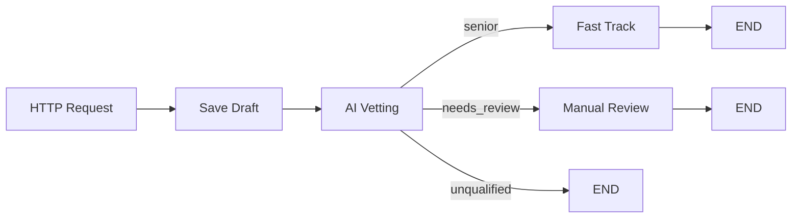

# Example: Candidate Onboarding

A complete example of an AI-powered candidate screening workflow.

## Overview

This workflow:

1. Saves a new candidate to the database
2. Uses AI to evaluate their experience
3. Routes them based on the evaluation



## Project Structure

```
project/
├── models/
│   └── candidate.yaml
├── workflows/
│   └── onboarding.yaml
├── nodes/
│   ├── __init__.py
│   └── onboarding.py
├── datasources/
│   └── postgres.yaml
└── agents/
    └── default.yaml
```

## Model Definition

```yaml title="models/candidate.yaml"
kind: "ModelDefinition"
version: "v1"
metadata:
  name: "Candidate"
spec:
  tablename: "candidates"
  schema: true
  fields:
    - name: "id"
      type: "uuid"
      primary_key: true
      default: "uuid4"
      input: false
      description: "Unique identifier"

    - name: "email"
      type: "string"
      unique: true
      required: true
      input: true
      description: "Candidate email address"

    - name: "full_name"
      type: "string"
      required: true
      input: true
      description: "Full name"

    - name: "experience_years"
      type: "integer"
      default: 0
      input: true
      description: "Years of experience"

    - name: "status"
      type: "string"
      default: "pending"
      input: false
      description: "Current status in pipeline"

    - name: "vetting_decision"
      type: "string"
      input: false
      description: "AI vetting decision"

    - name: "created_at"
      type: "timestamp"
      input: false
```

## Workflow Definition

```yaml title="workflows/onboarding.yaml"
kind: "Workflow"
metadata:
  name: "candidate_onboarding"
  description: "AI-powered candidate screening workflow"

context: "Candidate"

trigger:
  path: "/api/candidates/onboard"
  method: "POST"
  input_schema: "context"
  response_schema: "context"

steps:
  - id: "save_draft"
    kind: "functional"
    runner: "save_candidate"
    routes:
      default: "ai_vetting"
      error: "END"

  - id: "ai_vetting"
    kind: "agent"
    agent:
      model: "ollama/llama3"
      system: |
        You are a hiring assistant for a tech company.
        Evaluate candidates based on their experience level.
        Be fair and consistent in your assessments.
      prompt: |
        Evaluate this candidate:
        
        Name: {{ full_name }}
        Experience: {{ experience_years }} years
        
        Based on experience level, classify as:
        - "senior" if 5+ years experience
        - "unqualified" if less than 1 year
        - "needs_review" for everything in between
        
        Return ONLY valid JSON:
        {"decision": "senior" | "unqualified" | "needs_review", "reasoning": "brief explanation"}
      output:
        format: json
        map:
          decision: vetting_decision
          reasoning: vetting_reasoning
        signal_from: decision
      retry:
        attempts: 3
        on: [parse_error, timeout]
        backoff: 2
      timeout: 30
    routes:
      senior: "fast_track"
      unqualified: "END"
      needs_review: "manual_review"
      error: "manual_review"

  - id: "fast_track"
    kind: "functional"
    runner: "fast_track_candidate"
    routes:
      default: "END"

  - id: "manual_review"
    kind: "functional"
    runner: "flag_for_review"
    routes:
      default: "END"
```

## Node Implementations

```python title="nodes/onboarding.py"
from typing import Any
import logging

from tuvl_engine.nodes.base import node
from tuvl_engine.repositories.registry import get_repository

logger = logging.getLogger(__name__)


@node("save_candidate")
async def save_candidate(ctx: dict[str, Any]) -> dict[str, Any]:
    """Save new candidate to database."""
    session = ctx["_session"]
    repo = get_repository("Candidate", session)
    
    candidate = await repo.add({
        "email": ctx["email"],
        "full_name": ctx["full_name"],
        "experience_years": ctx.get("experience_years", 0),
        "status": "pending",
    })
    
    # Add generated fields to context
    ctx["id"] = str(candidate.id)
    ctx["status"] = candidate.status
    ctx["created_at"] = candidate.created_at.isoformat()
    
    logger.info(f"Saved candidate: {candidate.email}")
    return ctx


@node("fast_track_candidate")
async def fast_track_candidate(ctx: dict[str, Any]) -> dict[str, Any]:
    """Fast-track a senior candidate."""
    session = ctx["_session"]
    repo = get_repository("Candidate", session)
    
    await repo.update(ctx["id"], {
        "status": "fast_tracked",
    })
    
    ctx["status"] = "fast_tracked"
    ctx["message"] = "Candidate fast-tracked for interview"
    
    # In production, you might:
    # - Send welcome email
    # - Schedule interview
    # - Notify hiring manager
    
    logger.info(f"Fast-tracked: {ctx['email']}")
    return ctx


@node("flag_for_review")
async def flag_for_review(ctx: dict[str, Any]) -> dict[str, Any]:
    """Flag candidate for manual review."""
    session = ctx["_session"]
    repo = get_repository("Candidate", session)
    
    await repo.update(ctx["id"], {
        "status": "needs_review",
    })
    
    ctx["status"] = "needs_review"
    ctx["message"] = "Candidate flagged for manual review"
    
    # In production, you might:
    # - Create review ticket
    # - Notify HR team
    # - Add to review queue
    
    logger.info(f"Flagged for review: {ctx['email']}")
    return ctx
```

Make sure to import the module:

```python title="nodes/__init__.py"
from . import onboarding
```

## Testing the Workflow

### Start the server

```bash
tuvl dev
```

### Submit a senior candidate

```bash
curl -X POST http://localhost:8000/api/candidates/onboard \
  -H "Content-Type: application/json" \
  -d '{
    "email": "senior@example.com",
    "full_name": "Senior Developer",
    "experience_years": 8
  }'
```

Expected response:

```json
{
  "success": true,
  "status_code": 200,
  "data": {
    "id": "550e8400-e29b-41d4-a716-446655440000",
    "email": "senior@example.com",
    "full_name": "Senior Developer",
    "experience_years": 8,
    "status": "fast_tracked",
    "vetting_decision": "senior",
    "vetting_reasoning": "8 years of experience qualifies as senior level",
    "message": "Candidate fast-tracked for interview"
  },
  "error": null
}
```

### Submit a junior candidate

```bash
curl -X POST http://localhost:8000/api/candidates/onboard \
  -H "Content-Type: application/json" \
  -d '{
    "email": "junior@example.com",
    "full_name": "Junior Developer",
    "experience_years": 2
  }'
```

Expected response:

```json
{
  "success": true,
  "status_code": 200,
  "data": {
    "id": "...",
    "status": "needs_review",
    "vetting_decision": "needs_review",
    "message": "Candidate flagged for manual review"
  },
  "error": null
}
```

## Extending the Example

### Add Email Notifications

```python
@node("send_welcome_email")
async def send_welcome_email(ctx: dict[str, Any]) -> dict[str, Any]:
    await send_email(
        to=ctx["email"],
        subject="Welcome to Our Interview Process",
        body=f"Dear {ctx['full_name']}, ..."
    )
    ctx["email_sent"] = True
    return ctx
```

### Add External API Integration

```yaml
- id: "verify_email"
  kind: "api_call"
  api:
    url: "https://api.emailverifier.com/verify"
    method: "POST"
    headers:
      Authorization: "Bearer ${EMAIL_API_KEY}"
    body:
      email: "{{ email }}"
    output:
      map:
        valid: email_valid
        score: email_score
  routes:
    success: "save_draft"
    error: "END"
```

### Add Conditional Routing

```yaml
- id: "check_experience"
  kind: "router"
  router:
    conditions:
      - if: "experience_years >= 10"
        signal: "executive"
      - if: "experience_years >= 5"
        signal: "senior"
      - else: true
        signal: "standard"
  routes:
    executive: "executive_track"
    senior: "senior_track"
    standard: "ai_vetting"
```

## Next Steps

- [Custom Nodes](custom-nodes.md) — More node examples
- [Workflows](../concepts/workflows.md) — Workflow configuration
- [Agents](../configuration/agents.md) — LLM configuration
