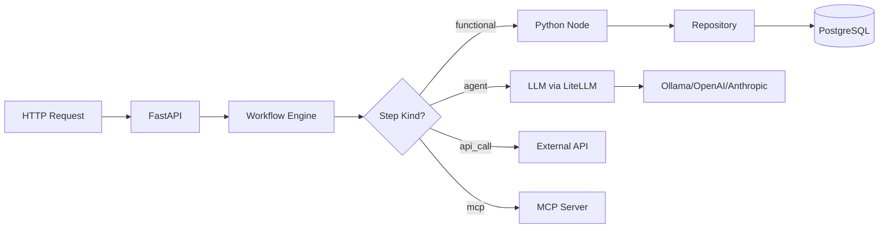

# tuvl

**A lightweight, local-first workflow orchestration engine for AI-powered business automation.**

<p align="center">
  <em>Pronounced "Thoo-val" (തൂവൽ) in Malayalam means a feather. It refers specifically to the soft feathers or plumage of a bird. </em>
</p>

---

## What is tuvl?

tuvl is a modular workflow engine that bridges the gap between deterministic code and probabilistic AI. It enables you to build complex business workflows using YAML-defined playbooks, with LLMs and traditional Python functions as interchangeable logic units.

```yaml title="workflows/onboarding.yaml"
kind: "Workflow"
version: "v1"
metadata:
  name: "candidate_onboarding"
  description: "AI-powered candidate vetting workflow"

spec:
  steps:
    - id: "save_draft"
      kind: "functional"
      runner: "db_save"

    - id: "ai_vetting"
      kind: "agent"
      agent:
        model: "ollama/llama3"
        prompt: |
          Evaluate this candidate: {{ full_name }}
          Experience: {{ experience_years }} years
      routes:
        senior: "fast_track"
        needs_review: "manual_review"
```

## Key Features

<div class="grid cards" markdown>

-   :material-cloud-off:{ .lg .middle } **Local-First**

    ---

    Run entirely on your infrastructure with Ollama for LLM inference. No data leaves your network.

-   :material-code-braces:{ .lg .middle } **YAML-Driven Workflows**

    ---

    Define complex business logic in readable YAML files. No more scattered code.

-   :material-robot:{ .lg .middle } **AI as a Function**

    ---

    Use LLMs as interchangeable logic units with structured JSON outputs and automatic routing.

-   :material-database:{ .lg .middle } **Dynamic Models**

    ---

    Define data models in YAML and get SQLModel classes, Pydantic schemas, and CRUD APIs automatically.

-   :material-source-branch:{ .lg .middle } **Flexible Routing**

    ---

    Branch workflows based on node outputs, AI decisions, or custom conditions.

-   :material-api:{ .lg .middle } **Auto-Generated APIs**

    ---

    Every workflow becomes an HTTP endpoint. Every model gets CRUD operations.

-   :material-monitor-dashboard:{ .lg .middle } **Insight Developer Portal**

    ---

    Browser-based UI for editing workflows, managing models, testing with Spectrum, and configuring IAM — all in dev mode.

    [:octicons-arrow-right-24: Explore the portal](insight/overview.md)

</div>

## Quick Example

```python title="nodes/onboarding.py"
from typing import Any
from tuvl_engine.nodes.base import node
from tuvl_engine.repositories.registry import get_repository

@node("db_save")
async def db_save(ctx: dict[str, Any]) -> dict[str, Any]:
    """Save a candidate to the database."""
    session = ctx["_session"]
    repo = get_repository("Candidate", session)
    
    candidate = await repo.add({
        "email": ctx["email"],
        "full_name": ctx["full_name"],
        "experience_years": ctx.get("experience_years", 0),
    })
    
    ctx["id"] = str(candidate.id)
    return ctx
```

## Architecture Overview



## Getting Started

Ready to build your first workflow?

[Get Started :material-arrow-right:](getting-started/installation.md){ .md-button .md-button--primary }
[View Examples :material-arrow-right:](examples/candidate-onboarding.md){ .md-button }

## License

tuvl is open source software licensed under the MIT license.
