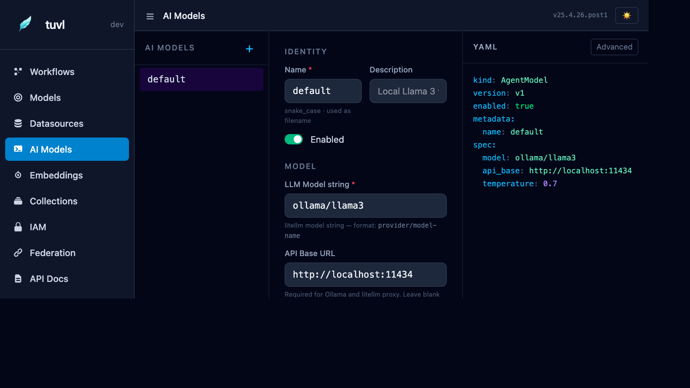

# AI Models

The AI Models section configures your `AgentModel` definitions — the LLM connections that power `Agent` steps in your workflows. tuvl uses [LiteLLM](https://docs.litellm.ai/) under the hood, which means you can connect to any major LLM provider with a single config file.



---

## File list

The sidebar lists every file in your project's `llms/` directory. Click any file to open the model editor.

---

## Form editor

The form is split into three sections:

### Identity

| Field | Description |
|-------|-------------|
| **Name** | Snake-case identifier used to reference this model in workflow YAML (e.g. `default`) |
| **Description** | Human-readable label shown in the portal |
| **Enabled** | Toggle to disable the model without deleting the file |

### Model

| Field | Description |
|-------|-------------|
| **LLM Model string** | LiteLLM model identifier in `provider/model-name` format |
| **API Base URL** | Required for Ollama, LiteLLM proxy, or self-hosted deployments |
| **API Key** | Provider API key; use `${ENV_VAR}` syntax to avoid hardcoding secrets |

### Parameters

| Field | Description |
|-------|-------------|
| **Temperature** | Sampling temperature (0 = deterministic, 2 = creative). Default: `0.7` |
| **Max Tokens** | Maximum completion length. Leave blank to use the provider default |
| **Timeout** | Completion timeout in seconds. Default: `60` |

---

## AgentModel YAML format

```yaml
kind: AgentModel
version: v1
enabled: true
metadata:
  name: default
  description: Local Llama 3 via Ollama
spec:
  model: ollama/llama3
  api_base: http://localhost:11434
  temperature: 0.7
  timeout: 60
```

---

## Provider examples

=== "Ollama (local)"

    ```yaml
    spec:
      model: ollama/llama3
      api_base: http://localhost:11434
    ```

    Run Ollama locally: `ollama serve` then `ollama pull llama3`.

=== "OpenAI"

    ```yaml
    spec:
      model: openai/gpt-4o
      api_key: "${OPENAI_API_KEY}"
    ```

=== "Anthropic"

    ```yaml
    spec:
      model: anthropic/claude-3-5-sonnet-20241022
      api_key: "${ANTHROPIC_API_KEY}"
    ```

=== "LiteLLM proxy"

    ```yaml
    spec:
      model: openai/my-model
      api_base: http://my-litellm-proxy:4000
      api_key: "${LITELLM_PROXY_KEY}"
    ```

=== "Azure OpenAI"

    ```yaml
    spec:
      model: azure/my-deployment
      api_base: "https://my-org.openai.azure.com"
      api_key: "${AZURE_OPENAI_API_KEY}"
    ```

---

## Using an AI model in a workflow

Reference the model by its `metadata.name` value in an `Agent` step:

```yaml
- id: score_cv
  kind: Agent
  agent:
    model: default          # matches AgentModel metadata.name
    prompt: |
      Score this CV: {{ full_name }}, {{ experience_years }} years experience.
      Return JSON: {"score": <int>, "route": "strong|weak"}
  routes:
    strong: fast_track
    weak: reject
```

The agent step passes the rendered prompt to the LLM, parses the JSON response, and routes to the step named in `routes` based on the `route` field of the response.

---

## Multiple models

You can define as many `AgentModel` files as you need. A common pattern is:

- `llms/default.yaml` — local Ollama model for fast iteration
- `llms/production.yaml` — GPT-4o or Claude for production quality
- `llms/judge.yaml` — a dedicated model for LLM-as-a-Judge test evaluation

Reference them by name in each workflow step.
