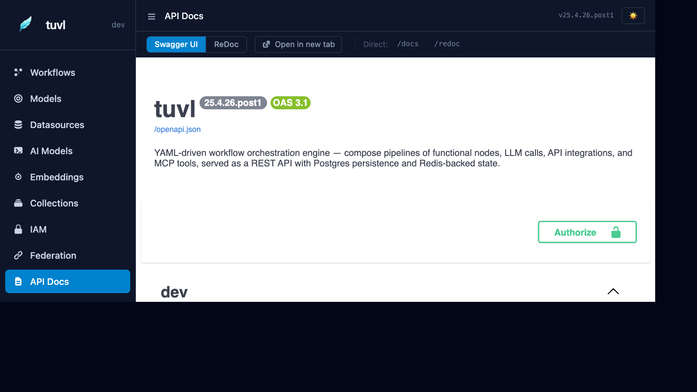

# API Docs

The **API Docs** section embeds a live Swagger UI for your project's REST endpoints. Every auto-generated CRUD route, workflow execution endpoint, and auth route is visible and callable directly from the browser.



---

## What you'll find here

The Swagger UI at `/insight/api-docs` proxies the OpenAPI schema from `/docs` and renders it in the portal's theme. It includes:

| Category | Routes |
|----------|--------|
| **Auth** | `/auth/token`, `/auth/bootstrap`, `/auth/admin/*`, `/auth/callback/*` |
| **System** | `/health`, `/registry`, `/` |
| **Workflow execution** | `/api/workflows/{name}/run`, `/api/workflows/{name}/stream` |
| **HITL** | `/hitl/tasks`, `/hitl/tasks/{id}/respond` |
| **Model CRUD** | `/api/{table}/` — auto-generated for each enabled `ModelDefinition` |
| **Vector collections** | `/api/collections/{name}/index`, `/api/collections/{name}/search` |

---

## Trying endpoints

1. Click the **Authorize** button (🔒) at the top of the Swagger UI.
2. Enter your access token in the `Bearer` field.
3. Expand any endpoint, click **Try it out**, fill in the parameters, and click **Execute**.

In dev mode, you can use the dev API key directly as a bearer token.

---

## Running a workflow via the API

```http
POST /api/workflows/screen_candidate/run
Authorization: Bearer <token>
Content-Type: application/json

{
  "full_name": "Jane Smith",
  "email": "jane@example.com",
  "experience_years": 7,
  "skills": ["Python", "FastAPI"]
}
```

Response:

```json
{
  "workflow": "screen_candidate",
  "status": "completed",
  "output": {
    "route": "strong",
    "score": 8,
    "summary": "Strong candidate with 7 years experience and relevant skills.",
    "id": "550e8400-e29b-41d4-a716-446655440000"
  }
}
```

---

## Streaming execution

For long-running workflows, use the SSE stream endpoint:

```http
GET /api/workflows/screen_candidate/stream?full_name=Jane+Smith&email=jane%40example.com
Authorization: Bearer <token>
Accept: text/event-stream
```

Each step emits an event:

```
event: step
data: {"step": "save_draft", "status": "completed", "duration_ms": 12.4}

event: step
data: {"step": "score_cv", "status": "completed", "duration_ms": 843.1}

event: done
data: {"route": "strong", "score": 8}
```

---

## Raw OpenAPI schema

The raw JSON schema is available at `/openapi.json`. Import it into Postman, Insomnia, or any API tool that accepts OpenAPI 3.x.
