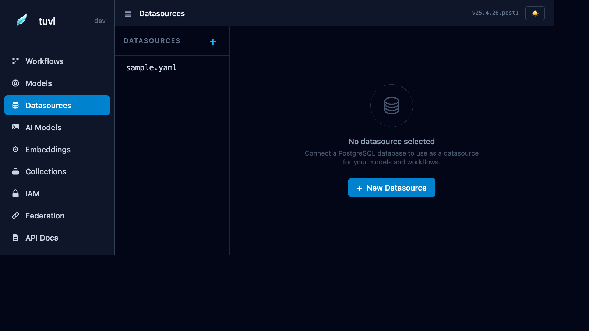

# Datasources

The Datasources section manages your PostgreSQL connection configuration files. Each `*.yaml` file under `datasources/` defines one named database connection.



---

## File list

The sidebar lists every file in your project's `datasources/` directory. Click any file to open the connection editor.

The status indicator shows whether the connection was successfully established at startup:

| Indicator | Meaning |
|-----------|---------|
| Green | Connected and healthy |
| Grey | Datasource is disabled (`enabled: false`) |
| Red | Connection failed at startup |

---

## Connection editor

The form has two tabs:

**Form view** — fill in host, port, database name, user, and password using familiar text inputs. tuvl shows a live YAML preview on the right as you type.

**YAML view** — edit the raw config file directly. Useful for adding advanced connection options.

---

## Datasource YAML format

```yaml
kind: Datasource
version: v1
enabled: true
metadata:
  name: primary_db
spec:
  type: postgres
  connection:
    host: "${POSTGRES_HOST:localhost}"
    port: "${POSTGRES_PORT:5432}"
    database: "${POSTGRES_DB:myapp}"
    user: "${POSTGRES_USER:postgres}"
    password: "${POSTGRES_PASSWORD:}"
  pool:
    min_size: 2
    max_size: 10
```

---

## Environment variable syntax

tuvl connection fields support `${ENV_VAR_NAME:default_value}` placeholders. At startup, tuvl substitutes the value from the environment. If the variable is not set, the default after `:` is used.

| Syntax | Behaviour |
|--------|-----------|
| `${POSTGRES_HOST:localhost}` | Use `POSTGRES_HOST` env var, fallback to `localhost` |
| `${POSTGRES_PASSWORD:}` | Use `POSTGRES_PASSWORD` env var, fallback to empty string |
| `${POSTGRES_HOST}` | Use `POSTGRES_HOST` env var, no fallback (empty string if unset) |

!!! tip "Local development"
    Set your credentials in a `.env` file at the project root. tuvl automatically loads `.env` on startup in dev mode.

---

## Multiple datasources

You can define multiple datasource files for different databases (e.g. `primary.yaml`, `analytics.yaml`, `test.yaml`). Each is registered by its `metadata.name` and can be referenced in model definitions:

```yaml
kind: ModelDefinition
version: v1
metadata:
  name: AnalyticsEvent
spec:
  datasource: analytics     # references datasources/analytics.yaml
  table: events
  fields: [ ... ]
```

If no `datasource` key is specified, the model uses the first enabled datasource.

---

## Automatic migrations

On startup, tuvl runs `CREATE TABLE IF NOT EXISTS` for every enabled model against its configured datasource. Existing tables are not dropped or truncated — only missing tables are created.

For production schema migrations, use a tool like [Alembic](https://alembic.sqlalchemy.org/).
