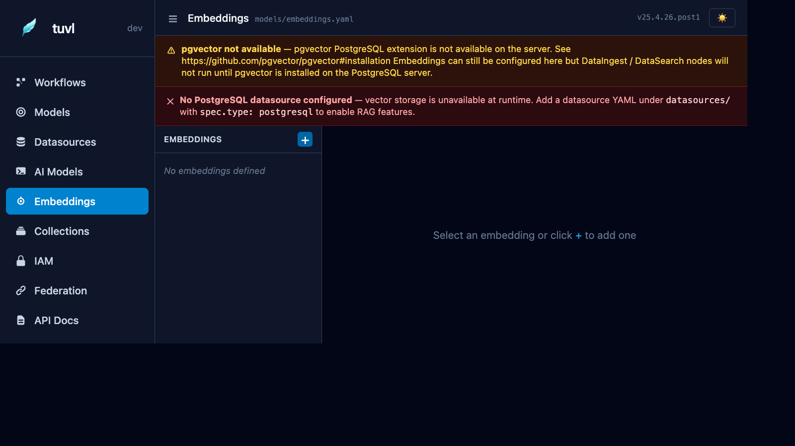
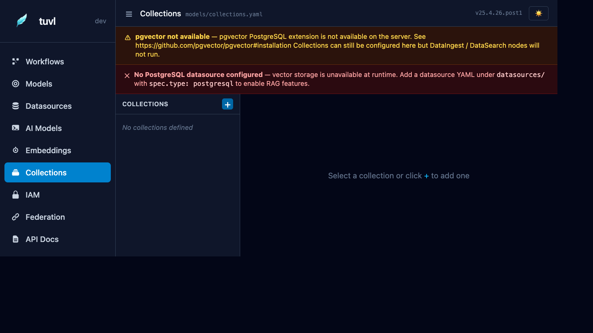

# Embeddings & Collections

The **Embeddings** and **Collections** sections configure tuvl's vector search stack. Together they power Retrieval-Augmented Generation (RAG) inside your workflows.

| Section | Screenshot |
|---------|-----------|
| Embeddings |  |
| Collections |  |

---

## Concepts

**Embedding model** — An `EmbeddingModel` config defines which model converts text into a vector (e.g. `nomic-embed-text` via Ollama, or OpenAI's `text-embedding-3-small`).

**Collection** — A `VectorCollection` config defines a named pgvector table: which embedding model to use, the vector dimension, and the distance metric. Think of a collection as a searchable knowledge base.

---

## Requirements

Both features require:

1. **pgvector extension** — installed in your PostgreSQL database:
   ```sql
   CREATE EXTENSION IF NOT EXISTS vector;
   ```
2. A connected and enabled **Datasource** (see [Datasources](datasources.md)).

---

## Embeddings

### EmbeddingModel YAML

```yaml
kind: EmbeddingModel
version: v1
enabled: true
metadata:
  name: default_embeddings
  description: Ollama nomic-embed-text
spec:
  model: ollama/nomic-embed-text
  api_base: http://localhost:11434
  dimensions: 768
```

| Field | Description |
|-------|-------------|
| `model` | LiteLLM embedding model string |
| `api_base` | Required for Ollama. Leave blank for cloud providers. |
| `dimensions` | Vector size — must match the model's output dimension |

### Common embedding models

| Provider | Model string | Dimensions |
|----------|-------------|------------|
| Ollama | `ollama/nomic-embed-text` | 768 |
| Ollama | `ollama/mxbai-embed-large` | 1024 |
| OpenAI | `openai/text-embedding-3-small` | 1536 |
| OpenAI | `openai/text-embedding-3-large` | 3072 |
| Cohere | `cohere/embed-english-v3.0` | 1024 |

---

## Collections

### VectorCollection YAML

```yaml
kind: VectorCollection
version: v1
enabled: true
metadata:
  name: hr_knowledge_base
  description: HR policy documents and FAQs
spec:
  embedding_model: default_embeddings   # references EmbeddingModel metadata.name
  dimensions: 768
  distance_metric: cosine               # cosine | l2 | inner_product
  table: hr_documents                   # PostgreSQL table name
```

### Distance metrics

| Metric | Use when |
|--------|----------|
| `cosine` | Most text similarity tasks (default) |
| `l2` | Euclidean distance — good for dense numerical embeddings |
| `inner_product` | Normalised embeddings where dot product == cosine |

---

## Using RAG in a workflow

Once an `EmbeddingModel` and `VectorCollection` are configured and enabled, tuvl registers automatic RAG nodes that you can call from `Functional` steps:

```yaml
- id: retrieve_policy
  kind: Functional
  runner: rag_search          # auto-registered by tuvl
  input:
    collection: hr_knowledge_base
    query: "{{ employee_question }}"
    top_k: 5
```

The RAG node returns the top-k chunks as a list in `ctx["rag_results"]`, which you can pass to a subsequent `Agent` step as context.

---

## Indexing documents

Use the auto-generated REST endpoint to index text into a collection:

```bash
curl -X POST http://localhost:8000/api/collections/hr_knowledge_base/index \
  -H "Authorization: Bearer <token>" \
  -H "Content-Type: application/json" \
  -d '{"text": "All employees are entitled to 25 days annual leave.", "metadata": {"source": "policy_v3.pdf"}}'
```

!!! note "Bulk indexing"
    For large document sets, use the `POST /api/collections/{name}/index-batch` endpoint, which accepts a JSON array of `{text, metadata}` objects and processes them with connection pooling.
