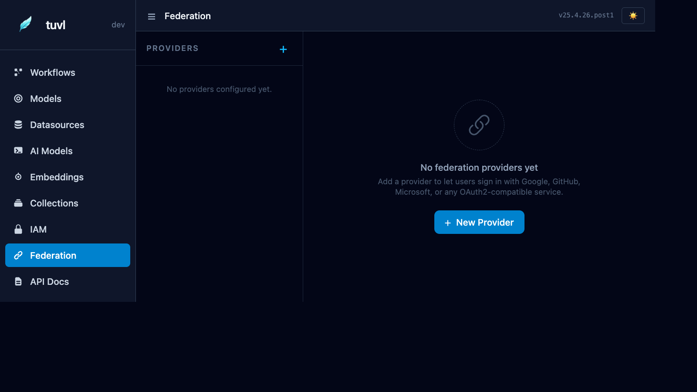

# Federation

The Federation section configures OAuth2 / OIDC social login providers. Once configured, users can sign in with Google, GitHub, Microsoft, or any OIDC-compliant provider instead of (or in addition to) email and password.



---

## How federation works

1. The user clicks **Sign in with Google** (or another provider) on the tuvl login page.
2. tuvl redirects to the provider's OAuth2 authorisation endpoint.
3. After the user consents, the provider redirects back to `http://<your-tuvl-host>/auth/callback/<provider>`.
4. tuvl exchanges the authorisation code for an access token, fetches the user's profile, and creates or links a tuvl user account.
5. A Biscuit token is issued and the user is logged in.

---

## Supported providers

| Provider | Config key |
|----------|-----------|
| Google | `google` |
| GitHub | `github` |
| Microsoft (Entra) | `microsoft` |
| Any OIDC provider | `oidc` |

---

## Provider YAML format

```yaml
kind: OAuthProvider
version: v1
enabled: true
metadata:
  name: google
spec:
  provider: google
  client_id: "${GOOGLE_CLIENT_ID}"
  client_secret: "${GOOGLE_CLIENT_SECRET}"
  scopes:
    - openid
    - email
    - profile
```

For generic OIDC:

```yaml
kind: OAuthProvider
version: v1
enabled: true
metadata:
  name: my_sso
spec:
  provider: oidc
  client_id: "${SSO_CLIENT_ID}"
  client_secret: "${SSO_CLIENT_SECRET}"
  discovery_url: "https://sso.example.com/.well-known/openid-configuration"
  scopes:
    - openid
    - email
    - profile
```

---

## Configuring a provider in the portal

Click **+ New Provider** to open the creation form:

| Field | Description |
|-------|-------------|
| Provider | Select from the dropdown (google, github, microsoft, oidc) |
| Client ID | OAuth2 application client ID from the provider console |
| Client Secret | Use `${ENV_VAR}` syntax to reference environment variables |
| Discovery URL | Required for generic OIDC providers |
| Scopes | Space-separated list of OAuth2 scopes to request |
| Enabled | Toggle without deleting the config |

---

## Callback URL

Register the following redirect URI in your OAuth2 provider console:

```
http://<your-tuvl-host>/auth/callback/<provider-name>
```

For example, if tuvl runs at `https://myapp.example.com` with provider name `google`:

```
https://myapp.example.com/auth/callback/google
```

!!! warning "Redis required for federation in multi-worker deployments"
    OAuth2 uses a CSRF state token that must survive until the provider's callback. In a multi-worker deployment, the callback may hit a different worker than the one that started the flow. Configure [Redis](settings.md) to share state across workers.

---

## Role mapping

By default, federated users are created with no roles. Assign roles after the first login via the [IAM panel](iam.md), or configure automatic role mapping based on email domain in your `OAuthProvider` spec:

```yaml
spec:
  provider: google
  client_id: "${GOOGLE_CLIENT_ID}"
  client_secret: "${GOOGLE_CLIENT_SECRET}"
  role_mapping:
    - domain: "mycompany.com"
      roles: ["employee"]
    - domain: "partner.com"
      roles: ["external_reviewer"]
```
