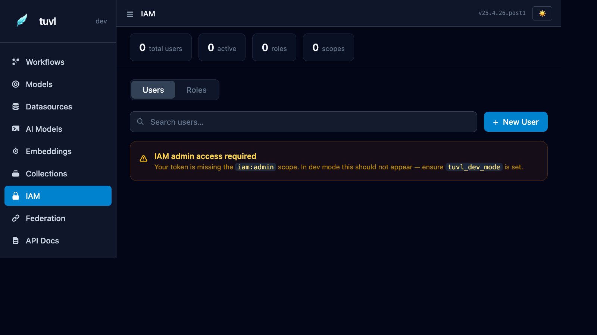

# IAM — Users, Roles & Scopes

The IAM section of the Insight portal is the browser-based interface for managing users, roles, and permission scopes. It mirrors the [IAM concepts](../security/iam.md) documented in the Security section.



---

## Overview

The dashboard shows four counters at the top:

| Counter | Meaning |
|---------|---------|
| Total users | All users in the database |
| Active | Users who have logged in at least once |
| Roles | Total number of defined roles |
| Scopes | Unique scopes across all roles |

Below the counters, tabs switch between the **users** and **roles** views.

---

## Users

### Listing users

The users table shows email, phone number, display name (first and last name), authentication method (password / federated), assigned roles, and whether the account is active. Use the search box to filter by email, phone number, or name.

### Creating a user

Click **+ New User** to open the creation dialog:

| Field | Description |
|-------|-------------|
| Email | Unique email address — can be used as the login username |
| Phone | Optional phone number — can also be used as the login username |
| First/Last Name | Basic user details |
| Password | Initial password (bcrypt-hashed at rest) |
| Roles | One or more roles to assign at creation |
| Active | Whether the account is immediately usable |

### Editing a user

Click any row to open the user detail panel. You can:

- Reset the password
- Add or remove roles
- Deactivate the account (without deleting it)
- Delete the user permanently

---

## Roles

### Listing roles

The roles tab shows every defined role and the scopes it grants.

### Creating a role

Click **+ New Role**:

| Field | Description |
|-------|-------------|
| Name | Unique role identifier (snake_case) |
| Scopes | Space- or newline-separated list of `resource:action` strings |

### Built-in scopes

| Scope | Gates |
|-------|-------|
| `iam:admin` | All `/auth/admin/*` endpoints, including this IAM panel |

All other scopes are application-defined. Create any `resource:action` strings that match what your workflows and custom nodes check via `ctx["_scopes"]`.

---

## Access requirements

!!! warning "iam:admin scope required"
    To view or modify users and roles through the portal, your session token must carry the `iam:admin` scope. In dev mode this is granted automatically to the dev-key session. If you see the "IAM admin access required" banner, check that `TUVL_DEV_MODE=true` is set and that you are logged in with the dev key.

---

## Bootstrap

When running tuvl for the first time against an empty database, use the bootstrap endpoint to create the first superadmin before any users exist:

```bash
curl -X POST http://localhost:8000/auth/bootstrap \
  -H "Content-Type: application/json" \
  -d '{"email": "admin@example.com", "phone_number": "+15551234567", "first_name": "Admin", "password": "change-me-now"}'
```

See the [IAM reference](../security/iam.md#bootstrap) for full details.

---

## REST API

All IAM operations are also available via the REST API under `/auth/admin/`:

| Method | Path | Action |
|--------|------|--------|
| `GET` | `/auth/admin/users` | List all users |
| `POST` | `/auth/admin/users` | Create a user |
| `GET` | `/auth/admin/users/{id}` | Get a user |
| `PUT` | `/auth/admin/users/{id}` | Update a user |
| `DELETE` | `/auth/admin/users/{id}` | Delete a user |
| `GET` | `/auth/admin/roles` | List all roles |
| `POST` | `/auth/admin/roles` | Create a role |
| `DELETE` | `/auth/admin/roles/{id}` | Delete a role |
