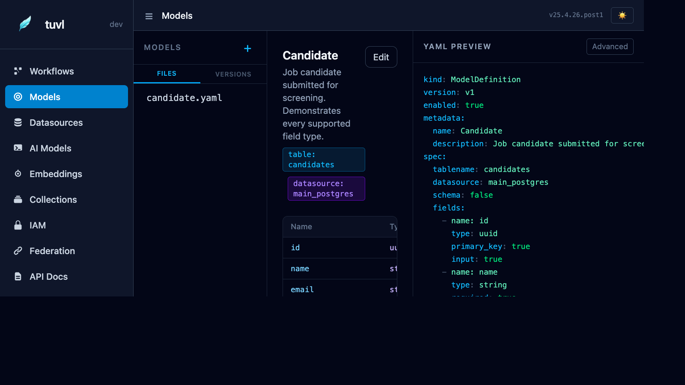

# Models

The Models section lets you view and edit your `ModelDefinition` YAML files. tuvl uses these definitions to auto-generate SQLModel classes, Pydantic schemas, and CRUD API endpoints at startup.



---

## File list

The sidebar lists every file under your project's `models/` directory. Click any file to open it.

---

## YAML editor

The editor shows the raw `ModelDefinition` YAML. Edit it inline and click **Save** to persist the change. The engine reloads the model registry on the next hot-reload cycle.

---

## ModelDefinition schema

```yaml
kind: ModelDefinition
version: v1
enabled: true
metadata:
  name: Candidate          # PascalCase — used as the Python class name
spec:
  table: candidates        # PostgreSQL table name (snake_case)
  fields:
    - name: full_name
      type: str
      required: true
    - name: email
      type: str
      required: true
      unique: true
    - name: experience_years
      type: int
      default: 0
    - name: skills
      type: list[str]
      default: []
    - name: status
      type: str
      default: "pending"
```

### Field types

| Type | PostgreSQL column | Python annotation |
|------|-------------------|-------------------|
| `str` | `TEXT` | `str` |
| `int` | `INTEGER` | `int` |
| `float` | `DOUBLE PRECISION` | `float` |
| `bool` | `BOOLEAN` | `bool` |
| `list[str]` | `JSONB` | `list[str]` |
| `dict` | `JSONB` | `dict[str, Any]` |
| `datetime` | `TIMESTAMPTZ` | `datetime` |
| `uuid` | `UUID` | `uuid.UUID` |

Every model automatically gets:

- `id` — UUID primary key
- `created_at` — timestamp with time zone
- `updated_at` — timestamp with time zone (auto-updated on save)

---

## Auto-generated APIs

When a model is loaded, tuvl mounts CRUD routes at `/api/<table-name>/`:

| Method | Path | Action |
|--------|------|--------|
| `GET` | `/api/candidates/` | List all rows (supports `?limit` and `?offset`) |
| `POST` | `/api/candidates/` | Create a new row |
| `GET` | `/api/candidates/{id}` | Read a single row by UUID |
| `PUT` | `/api/candidates/{id}` | Full update |
| `PATCH` | `/api/candidates/{id}` | Partial update |
| `DELETE` | `/api/candidates/{id}` | Delete |

!!! note "Swagger UI"
    All generated endpoints appear in the **API Docs** section of the Insight portal and in the standard `/docs` Swagger UI.

---

## Using a model in a workflow

Reference the model by its `metadata.name` value in a `model-op` step:

```yaml
- id: save_candidate
  kind: model-op
  op: add
  model: Candidate
```

Available operations: `add`, `get`, `update`, `delete`, `list`.

---

## Versions tab

Like workflows, every model definition is versioned. The **Versions** tab shows the diff history so you can track schema changes over time.
