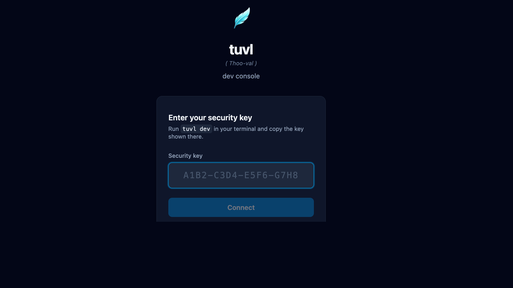

# Insight Developer Portal

The **Insight developer portal** is tuvl's browser-based management UI. It is automatically served when you run `tuvl dev` and gives you a live view into everything your project contains — workflows, models, datasources, AI models, vector indexes, users, and more — without writing a single line of code.



---

## Accessing the portal

Start the dev server from your project directory:

```bash
cd my-project/
tuvl dev
```

tuvl prints the portal URL and a one-time security key:

```
╭─ tuvl dev ───────────────────────────────────────────────────────────╮
│ Starting tuvl engine in dev mode on port 8000.                       │
│ Project: /home/user/my-project                                       │
│                                                                      │
│ Open http://127.0.0.1:8000/insight/ and the security key is stored  │
│ in .tuvl/.dev-session (run tuvl dev --show-key to print it).         │
╰──────────────────────────────────────────────────────────────────────╯
```

tuvl also opens the portal in your default browser automatically. Paste the security key from `.tuvl/.dev-session` when prompted.

!!! tip "Print the key directly"
    Use `tuvl dev --show-key` to print the key in the terminal output. The default is to store it silently so shell history recordings cannot capture it.

!!! info "Dev mode only"
    The Insight portal is only available when `TUVL_DEV_MODE=true`. It is never served in production builds to eliminate any attack surface.

---

## Portal navigation

The sidebar contains all top-level sections:

| Section | Description |
|---------|-------------|
| **Workflows** | View, edit, and visualise your workflow YAML files |
| **Models** | Inspect and edit `ModelDefinition` files |
| **Datasources** | Manage PostgreSQL connection configs |
| **AI Models** | Configure LLM agents (Ollama, OpenAI, Anthropic, …) |
| **Embeddings** | Define embedding model configs for vector search |
| **Collections** | Manage pgvector collections for RAG |
| **IAM** | Users, roles, and scope management |
| **Federation** | OAuth2 / OIDC provider setup |
| **API Docs** | Live Swagger UI for your project's REST endpoints |
| **Spectrum** | Workflow test runner and visual debugger |
| **Settings** | Redis, telemetry, and LLM Judge configuration |

---

## How it works

The portal communicates with the tuvl engine over **gRPC-Web** (via `DevService`) for all file operations and dev-only queries. The `DevService` exposes endpoints for listing files, reading/writing YAML configs, running single-node Lens probes, and streaming full workflow executions through Spectrum.

Regular workflow execution and auth endpoints use the standard REST API at `/api/*`.

---

## Requirements

| Requirement | Version |
|-------------|---------|
| `tuvl` | ≥ 25.4 |
| `tuvl-insight` | Included with `pip install tuvl[standard]` |
| Browser | Any modern Chromium, Firefox, or Safari |

!!! warning "tuvl_insight package"
    The portal is shipped as the separate `tuvl_insight` package. It is bundled when you install with the `standard` extra: `pip install tuvl[standard]`. If you install the bare `tuvl` package, the portal will not be available.
