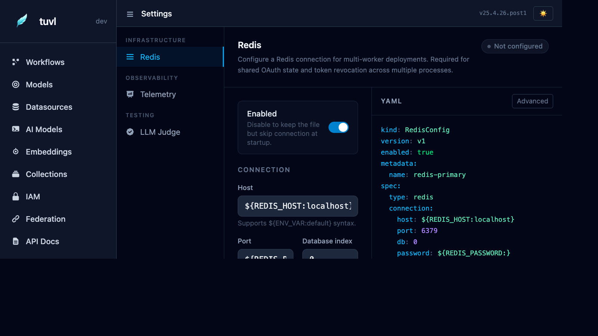

# Settings

The Settings section configures project-level infrastructure and observability integrations. Changes are written to YAML config files and take effect after a reload.



---

## Navigation

The left panel groups settings into three categories:

| Category | Item | Purpose |
|----------|------|---------|
| Infrastructure | Redis | Shared state for multi-worker deployments |
| Observability | Telemetry | OpenTelemetry trace and metric export |
| Testing | LLM Judge | Automated quality evaluation for CI |

---

## Redis

Redis is required when running tuvl with more than one uvicorn worker. Without Redis, OAuth2 CSRF state tokens and Biscuit token revocation lists are stored only in each worker's memory — causing random failures when a request lands on a different worker than the one that started the session.

### Redis YAML format

```yaml
kind: RedisConfig
version: v1
enabled: true
metadata:
  name: redis-primary
spec:
  type: redis
  connection:
    host: "${REDIS_HOST:localhost}"
    port: "${REDIS_PORT:6379}"
    db: 0
    password: "${REDIS_PASSWORD:}"
```

### Redis fields

| Field | Description | Default |
|-------|-------------|---------|
| `host` | Redis server hostname | `localhost` |
| `port` | Redis port | `6379` |
| `db` | Database index (0–15) | `0` |
| `password` | AUTH password (leave blank for no auth) | _(empty)_ |

!!! note "env var syntax"
    All fields support `${ENV_VAR:default}` substitution. Set `REDIS_HOST`, `REDIS_PORT`, and `REDIS_PASSWORD` in your `.env` file or environment.

---

## Telemetry

tuvl ships with built-in [OpenTelemetry](https://opentelemetry.io/) support. Traces and metrics can be exported to any OTLP-compatible backend (Jaeger, Tempo, Honeycomb, Datadog, …).

### Telemetry YAML format

```yaml
kind: TelemetryConfig
version: v1
enabled: true
metadata:
  name: otel
spec:
  exporter: otlp-grpc              # otlp-grpc | otlp-http | jaeger | console
  endpoint: "${OTEL_EXPORTER_OTLP_ENDPOINT:http://localhost:4317}"
  service_name: "${OTEL_SERVICE_NAME:tuvl}"
  sample_rate: 1.0                 # 0.0–1.0  (1.0 = trace everything)
```

### Exporter options

| Exporter | Description |
|----------|-------------|
| `otlp-grpc` | OpenTelemetry Protocol over gRPC (default) |
| `otlp-http` | OpenTelemetry Protocol over HTTP/JSON |
| `jaeger` | Jaeger native UDP exporter (legacy) |
| `console` | Print spans to stdout — useful for debugging |

See the [Telemetry configuration guide](../configuration/telemetry.md) for a full guide including Grafana Tempo setup.

---

## LLM Judge

The LLM Judge powers tuvl's `tuvl test` command. It evaluates workflow outputs against natural-language quality criteria using a secondary LLM.

### LLM Judge YAML format

```yaml
kind: LLMJudgeConfig
version: v1
enabled: true
metadata:
  name: judge
spec:
  model: default          # references an AgentModel metadata.name
  temperature: 0.0        # deterministic for consistent scoring
  pass_threshold: 0.8     # 0.0–1.0; runs below this score are flagged
```

### Judge fields

| Field | Description |
|-------|-------------|
| `model` | AgentModel to use for evaluation (see [AI Models](ai-models.md)) |
| `temperature` | Set to `0.0` for reproducible judgements |
| `pass_threshold` | Minimum pass score (0.0–1.0). Runs below this fail the test. |

See the [LLM Judge guide](../configuration/llm-judge.md) and the [Testing Workflows](../tools/testing.md) reference for how to write test cases and run them in CI.
