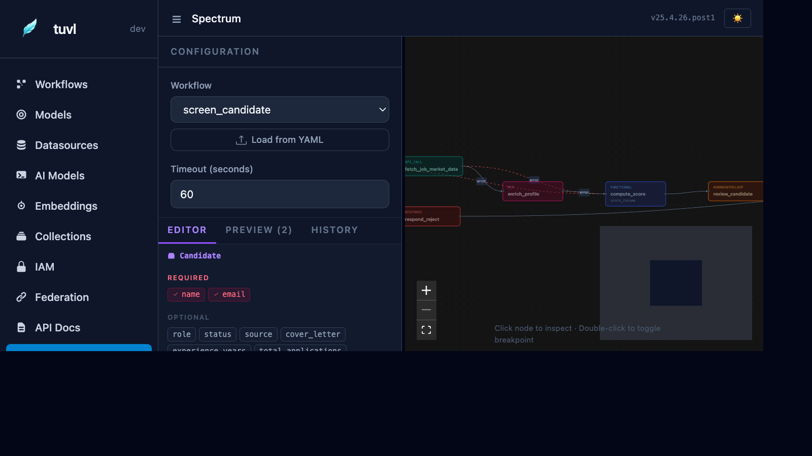

# Spectrum — Workflow Test Runner

Spectrum is tuvl's built-in visual debugger for workflows. It lets you trigger a complete workflow execution with a custom JSON payload and watch every step fire in real time on the workflow canvas. All node outputs, routing decisions, and context mutations are visible as the run progresses.



---

## Accessing Spectrum

Click **Spectrum** in the Insight sidebar. Spectrum is only available in dev mode (`TUVL_DEV_MODE=true`).

---

## Running a workflow

1. **Select a workflow** from the dropdown at the top.
2. The workflow canvas renders below, showing all nodes and edges in the workflow graph.
3. **Edit the input payload** in the JSON editor on the left panel. The editor is pre-populated with a schema-aware skeleton based on the workflow's input model (if defined).
4. Click **Run** to execute the workflow.

---

## Execution canvas

As the workflow runs, each node transitions through states:

| Node state | Colour | Meaning |
|------------|--------|---------|
| Pending | Grey | Not yet reached |
| Running | Blue pulse | Currently executing |
| Completed | Green | Finished successfully |
| Routed away | Faded | Skipped due to routing |
| Error | Red | Node threw an exception |

Clicking a completed node opens a side panel showing:

- **Input context** — the `ctx` dict that was passed in
- **Output context** — the `ctx` dict returned
- **Duration** — execution time in milliseconds
- **Error** — stack trace if the node failed

---

## Step-through mode (breakpoints)

Click the **pause** icon on any node before running to set a breakpoint. Spectrum pauses execution after that node and waits for you to click **Continue**. This is useful for inspecting intermediate context values.

---

## Streaming output

Long-running workflows (e.g. those with HITL steps) show intermediate events as they arrive via Server-Sent Events. The event log panel at the bottom of Spectrum lists every step event in order.

---

## Lens — single node testing

From the node detail panel, click **Run in Lens** to execute just that one node in isolation against any input context you specify. Lens is useful for testing individual Python functions or agent prompts without running the full workflow.

See [Spectrum — Workflow Debugging](../tools/spectrum.md) for the full gRPC API reference for Lens and Spectrum.

---

## Example: testing the candidate screener

With the sample project running, select `screen_candidate` from the dropdown and paste:

```json
{
  "full_name": "Jane Smith",
  "email": "jane@example.com",
  "experience_years": 7,
  "skills": ["Python", "FastAPI", "PostgreSQL", "Machine Learning"]
}
```

Click **Run**. You will see:

1. `save_draft` → green (candidate saved to DB)
2. `score_cv` → green (LLM scores Jane's CV)
3. `fast_track` → green (LLM routed to `strong` → `fast_track`)

The other branches (`standard_review`, `reject`) stay grey.
