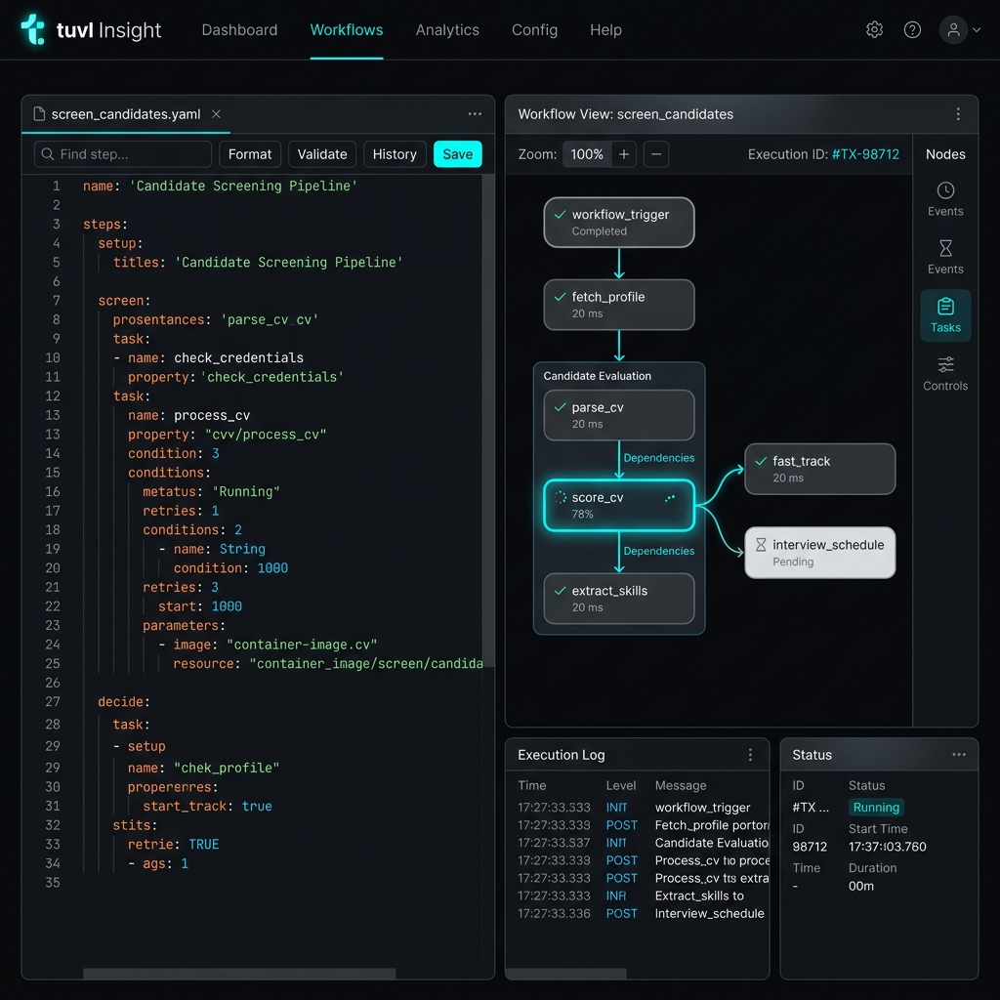

# Workflows

The Workflows section of the Insight portal is a live YAML editor and visual graph viewer for all your workflow definition files. Every change you save is immediately reflected in the running engine.



---

## File list

The left sidebar lists every `*.yaml` file found under your project's `workflows/` directory. Click any file to open it in the editor panel.

A coloured dot indicates the status:

| Indicator | Meaning |
|-----------|---------|
| Green dot | Workflow is loaded and enabled in the engine |
| Grey dot | File is present but `enabled: false` |
| Red dot | File failed to parse or load |

---

## YAML editor

The main panel shows the raw YAML for the selected workflow. You can edit it directly in the browser — the editor provides syntax highlighting and basic validation.

Click **Save** to write the file to disk. The engine hot-reloads the file automatically (no restart needed in dev mode).

Click **Cancel** to discard unsaved edits and restore the last saved state.

---

## Visual graph

Switch to the **Graph** tab to see a node-by-node canvas of the workflow execution path. Each step kind is rendered in a distinct colour:

| Node colour | Step kind |
|-------------|-----------|
| Blue | `agent` — LLM call |
| Green | `functional` — Python node |
| Purple | `api_call` — external HTTP call |
| Orange | `mcp` — MCP tool call |
| Teal | `model-op` — repository operation |
| Yellow | `hitl` — human-in-the-loop pause |
| Red | `router` — conditional branching |
| Grey | `response` — terminal response step |

Arrows between nodes show the routes declared in the YAML. Click **Fit view** to auto-zoom the canvas to the full graph.

---

## Versions tab

The **Versions** tab shows the full version history for the selected workflow, including the hash, timestamp, and diff from the previous version. tuvl records a new version entry every time a workflow file changes on disk.

---

## Creating a workflow

Click the **+** button at the top of the sidebar to scaffold a new workflow file. tuvl creates a minimal skeleton YAML:

```yaml
kind: Workflow
version: v1
metadata:
  name: my_workflow
  description: ""
spec:
  steps: []
```

Rename the file by changing the `metadata.name` field and saving — tuvl renames the file on disk to match.

---

## Example workflow YAML

The sample project includes `screen_candidate`, a full-featured workflow with all eight step kinds:

```yaml
kind: Workflow
version: v1
metadata:
  name: screen_candidate
  description: >
    AI-powered candidate screening pipeline.
    Saves the candidate, scores their CV with an LLM,
    enriches with LinkedIn data, and routes to the correct HR queue.
enabled: true
spec:
  steps:
    - id: save_draft
      kind: model-op
      op: add
      model: Candidate

    - id: score_cv
      kind: agent
      agent:
        model: default
        prompt: |
          Score this candidate's CV from 0-10.
          Name: {{ full_name }}
          Experience: {{ experience_years }} years
          Skills: {{ skills }}
          Return JSON: {"score": <int>, "summary": "<str>", "route": "strong|average|weak"}
      routes:
        strong: fast_track
        average: standard_review
        weak: reject

    - id: fast_track
      kind: functional
      runner: notify_hr_fast_track

    - id: standard_review
      kind: functional
      runner: notify_hr_standard

    - id: reject
      kind: response
      response:
        status: 200
        body: '{"message": "Thank you for applying. We will be in touch."}'
```
