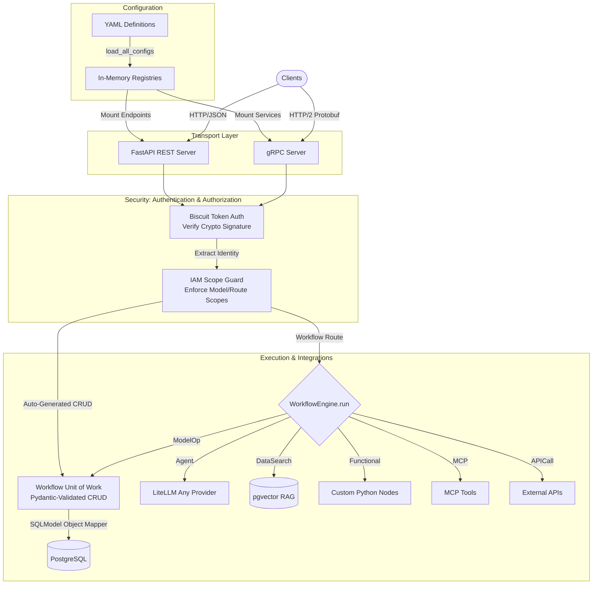

# TUVL Agentic Configuration Manual

> **Audience:** Autonomous AI coding agents and agentic IDEs.
> **Purpose:** Deterministic instruction set for emitting valid, production-ready TUVL YAML from arbitrary business requirements.
> **Scope:** Single-tenant deployment only. Multi-tenancy, RLS, and `tenant_id` are out of scope and **must not** appear in generated YAML.
> **Version of contract:** Derived from the live source tree at `tuvl/src/tuvl/core/` — this manual is the ground truth for code generation; never invent fields, kinds, or behaviours absent here.

---

## 1. The TUVL Mental Model

TUVL is a **stateless ASGI router** that loads declarative YAML configurations at startup and mounts them as live FastAPI routes.

> **Current version:** `2026.3.1.0`  
> Run `tuvl --version` (alias `-v`) to confirm the active version at any time.



Operational invariants the agent must encode:

1. **Everything declarative.** A new business capability = one or more YAML documents. Python code is required only for `kind: Functional` `runner:` implementations (custom nodes).
2. **Recursive YAML discovery.** `load_all_configs()` walks the entire project directory tree. **The folder name is irrelevant — the `kind:` field dispatches the file to its registry.** A `Workflow` can live anywhere.
3. **Strict load order is enforced by the loader** (see §3.1). Models load before Workflows; Embeddings before Collections; DataSources before Workflows that reference them.
4. **All YAML documents are uniquely keyed by `(kind, metadata.name, metadata.schema_version)`.** Multiple versions of the same logical resource coexist.
5. **The runtime is stateless.** Per-request state lives in the `context: dict[str, Any]` that flows through every step. The engine commits the Postgres session on success, rolls back on exception.
6. **No hidden defaults for routing.** Steps advance via explicit `routes:` maps keyed by **signals** (`default`, `error`, custom). Missing routes for non-`default` signals raise.
7. **LiteLLM is the only LLM I/O layer.** Any model string LiteLLM understands is valid (`openai/gpt-4o`, `ollama/llama3`, `anthropic/claude-3-5-sonnet-20241022`, `groq/...`, `gemini/...`, etc.).
8. **pgvector is the only retrieval substrate.** RAG is implemented by the built-in `DataIngest` and `DataSearch` system nodes against a single physical `system_vector_store` table partitioned by `collection`.

---

## 2. YAML Schema Contracts

### 2.0 Universal envelope

Every TUVL document **must** carry:

```yaml
kind: <KindName>             # REQUIRED — exact string from the supported list
version: v1                  # OPTIONAL document-format version (not the schema_version)
enabled: true                # OPTIONAL — default true. false → registered but not mounted
metadata:
  name: <resource_name>      # REQUIRED — unique within (kind, schema_version)
  schema_version: v1         # OPTIONAL — default "v1". Resource version pin.
  description: <free text>   # OPTIONAL
spec:
  ...                        # Kind-specific body
```

### 2.1 Supported `kind:` values (closed set)

| `kind:` | Loader | Loaded from |
|---|---|---|
| `ModelDefinition`    | `tuvl.core.models.loader`              | anywhere (typically `models/`)        |
| `EmbeddingRegistry`  | `tuvl.core.models.embeddings_loader`   | `models/embeddings.yaml` recommended  |
| `EmbeddingConfig`    | same                                    | one-per-file alternative              |
| `CollectionRegistry` | `tuvl.core.models.collections_loader`  | `models/collections.yaml` recommended |
| `CollectionConfig`   | same                                    | one-per-file alternative              |
| `DataSource`         | `tuvl.core.datasources.loader`         | `datasources/`                        |
| `RedisConfig`        | same (alias of DataSource)             | `datasources/`                        |
| `FederationProvider` | `tuvl.core.auth.federation_loader`     | `federation/`                         |
| `Workflow`           | `tuvl.core.api.manager`                | anywhere (typically `workflows/`)     |
| `AgentModel`         | lazy, by `AgentRunner`                 | **must** live at `llms/<name>.yaml`   |
| `ProjectConfig`      | `tuvl.core.config.Settings`       | `config.yaml`                         |
| `TelemetryConfig`    | telemetry init                          | `telemetry.yaml`                      |
| `SystemConfig`       | bootstrap                               | `.tuvl/system.yaml` (do not write)   |

Any other `kind:` value is silently ignored by `load_all_configs()` (logged at DEBUG). Agents **must not** emit unknown kinds.

### 2.2 `kind: ModelDefinition`

Declares a SQLModel table + auto-generated Pydantic Create/Read/Update schemas + optional CRUD REST endpoints.

```yaml
kind: ModelDefinition
metadata:
  name: Candidate               # PascalCase. Becomes MODEL_REGISTRY key.
  schema_version: v1            # default "v1"
enabled: true
spec:
  tablename: candidates         # OPTIONAL — defaults to name.lower()
  datasource: main_postgres     # OPTIONAL — defaults to "main_postgres"
  schema: true                  # OPTIONAL — default true. false → no CRUD endpoints
  fields:
    - name: id
      type: uuid
      primary_key: true
      default: uuid4            # literal sentinel → uuid4()
      input: false              # exclude from Create schema
    - name: email
      type: string
      required: true
      unique: true
      index: true
      input: true
    - name: name
      type: string
      required: true
    - name: profile
      type: jsonb               # uses PG JSONB
    - name: ssn
      type: string
      secure: true              # value masked as "*****" in OTel spans
    - name: created_at
      type: timestamptz         # auto-defaults to now() when no default given
  relations:                    # OPTIONAL — enables ?include=... and model-op include
    - name: applications
      model: Application
      foreign_key: candidate_id
      type: one_to_many         # many_to_one | one_to_many
```

**Field `type:` enum** (strict — anything else falls back to `str` silently; do not rely on that):

`string`, `text`, `varchar`, `integer`, `bigint`, `smallint`, `numeric`, `float`, `boolean`, `uuid`, `date`, `timestamp`, `timestamptz`, `jsonb`, `bytea`, `enum`.

`enum` creates a **native PostgreSQL `ENUM` type** on the column (named `{tablename}_{field}_enum`). The allowed values are declared via `enum_values: [...]`. The API layer validates submissions against `Literal[...values...]` before any DB round-trip. Use `enum` over `string` whenever the set of valid values is finite and stable — the DB enforces the constraint independently of application logic.

**Field options** (all OPTIONAL except `name`, `type`):

| Key | Type | Default | Notes |
|---|---|---|---|
| `primary_key` | bool | `false` | Exactly one field per model should be PK. |
| `required` | bool | `false` | Maps to NOT NULL. PK is implicitly required. |
| `unique` | bool | `false` | UNIQUE constraint. |
| `index` | bool | `false` | B-tree index. |
| `default` | scalar \| `"uuid4"` | none | Literal default. `"uuid4"` → `uuid.uuid4` factory. |
| `input` | bool | `true` when not PK | If `false`, omitted from Create/Update schemas. |
| `secure` | bool | `false` | Masked in telemetry context snapshots. |
| `description` | str | `""` | Surfaces in OpenAPI. |
| `enum_values` | list[str] | — | **Required when `type: enum`**. Declares the full closed set of valid values. PostgreSQL enforces the constraint; Pydantic validates API requests against `Literal[...values...]`. Example: `[draft, active, terminated]`. |

**Auto-defaults** when `default:` is absent: `uuid` → uuid4, `date` → today, `timestamp`/`timestamptz` → now.

**Access control** (`spec.access:` — OPTIONAL): Override the default scope names enforced on the auto-generated CRUD routes. When omitted, scopes derive from the model name: `{modelname.lower()}:read`, `{modelname.lower()}:write`, `{modelname.lower()}:delete`. Tokens carrying `iam:admin` bypass every scope check regardless of what is configured here. Use this block only when the model's CRUD actions must sit under a different IAM domain than the model name itself.

```yaml
spec:
  access:                         # OPTIONAL — override derived CRUD scope names
    read_scope:   hr_data:read    # default: {modelname.lower()}:read
    write_scope:  hr_data:write   # default: {modelname.lower()}:write
    delete_scope: hr_data:delete  # default: {modelname.lower()}:delete
```

`GET /admin/scopes` returns all scope strings registered in the live engine — CRUD scopes (respecting any `spec.access` overrides), workflow `required_scope` values, and system scopes — grouped by source. The IAM role editor in Tuvl Insight surfaces this as a clickable scope-suggestion palette so administrators can assign the correct scope strings without consulting YAML files.

**Reserved Python attribute names**: `metadata`. If used, the SQLAlchemy attribute becomes `extra_metadata` but the DB column and JSON key remain `metadata`. Agents may use `metadata` as a field name freely; the loader handles aliasing.

**Cross-version collision rule**: Two enabled `ModelDefinition` documents with the same `metadata.name` but different `schema_version` **must not** target the same `spec.tablename` with divergent field shapes. Resolution: give each version its own `tablename`, or set `enabled: false` on the inactive version.

### 2.3 `kind: Workflow`

```yaml
kind: Workflow
metadata:
  name: onboard_candidate
  schema_version: v1            # default "v1"
  description: "Score and persist a new candidate."
  group: hr                     # OPTIONAL — OpenAPI tag
  required_scope: candidate:write   # OPTIONAL — Biscuit scope gate
  required_group: hr_manager        # OPTIONAL — IAM group gate
enabled: true
spec:
  context:                      # see §2.3.1 — three forms supported
    models:
      - name: Candidate
        version: v1             # OPTIONAL — pin a ModelDefinition schema_version
      - name: Application
  trigger:
    path: /api/onboard          # REQUIRED to mount as HTTP route. Omit → workflow exists but is not mounted (callable via /{schema_version}/run/{name})
    method: POST                # GET | POST | PUT | PATCH | DELETE
    input_schema: context       # see §2.3.2
    response_schema: Candidate.read
  steps:
    - id: ...
      kind: ...
      routes: { default: END }
  output: candidate             # OPTIONAL — top-level context key returned as HTTP body. Overridden by `kind: Response` steps.
```

#### 2.3.1 `context:` — three forms (mutually exclusive)

| Form | Example | Effect |
|---|---|---|
| String | `context: Candidate` | Single model allowed. |
| List | `context: [Candidate, Job]` | Multiple models, all default versions. |
| Dict + `models:` | `context: { models: [{name: Candidate, version: v2}] }` | Multiple models with explicit `schema_version` pins. |

The set of declared model names becomes the `WorkflowUoW` allow-list — any `ModelOp` step or custom node accessing a model **not in this list** raises `PermissionError`. Generators **must** enumerate every model the workflow touches.

Version pins are enforced at runtime: if `MODEL_REGISTRY["Candidate"].__schema_version__ != "v2"`, the engine refuses to execute and raises a `RuntimeError`.

#### 2.3.2 `trigger.input_schema` / `trigger.response_schema`

Accepted shapes:

| Value | Meaning |
|---|---|
| `"context"` | Build a Pydantic model from `spec.context`. Single model → flat. Multiple → nested under each `model_name.lower()`. |
| `"<ModelName>.<variant>"` | One of `create` \| `read` \| `update` \| `expanded`. E.g. `Candidate.read`. |
| `"list[<ModelName>.<variant>]"` | Array of records. |
| Inline list of `{name,type,required,default,description}` | Ad-hoc schema (`type` ∈ `string|integer|float|boolean`). |
| omitted | Untyped — request body becomes the raw context dict. |

#### 2.3.3 Step envelope (common to every `kind:`)

```yaml
- id: <unique_within_workflow>
  kind: Functional | Agent | Router | APICall | MCP | ModelOp | Response | HumanInTheLoop
  routes:                       # OPTIONAL
    default: <next_step_id>     # taken when signal == "default" and key present
    error:   <next_step_id>     # taken when signal == "error"
    <custom_signal>: <step_id>  # e.g. "true", "false", "approved"
    # Special target: END   → terminate workflow
```

Routing rules (deterministic):

1. The step returns a `signal` (string). Built-in signals: `"default"`, `"error"`. Routers return `"true"` / `"false"`. Agents may return any string when `output.signal_from` is set.
2. If `routes[signal]` exists → jump to that step (`END` terminates).
3. If signal is `"default"` and not in `routes` → fall through to the next sequential step.
4. If signal is `"error"` and not in `routes` → terminate workflow early.
5. If signal is anything else and not in `routes` → **hard `RuntimeError`**. Always map every non-default signal you intend to emit.

### 2.4 `kind: AgentModel` (LLM preset)

Located at `llms/<name>.yaml`. Referenced from `agent:` steps via `agent.model: <name>` (no `/`).

```yaml
kind: AgentModel
metadata:
  name: default
enabled: true
spec:
  provider: openai              # informational; routing is via the `model` string
  model: openai/gpt-4o-mini     # LiteLLM model string
  api_base: ${LITELLM_PROXY_URL}    # OPTIONAL — env interpolation supported
  api_key: ${OPENAI_API_KEY}        # OPTIONAL
  temperature: 0.2              # OPTIONAL
  max_tokens: 1024              # OPTIONAL
  timeout: 60                   # OPTIONAL — seconds
```

When `agent.model` in a workflow contains a `/` it is treated as a direct LiteLLM model string and the AgentModel file is bypassed.

### 2.5 `kind: DataSource` (Postgres)

```yaml
kind: DataSource
metadata:
  name: main_postgres           # workflows/models route to this by name
  primary: true                 # OPTIONAL — exactly one DS should be primary. System tables go here.
enabled: true
spec:
  type: postgresql              # postgres | postgresql
  driver: asyncpg               # only asyncpg is supported
  connection:
    host: ${POSTGRES_HOST}
    port: ${POSTGRES_PORT:5432}
    database: ${POSTGRES_DB}
    username: ${POSTGRES_USER}
    password: ${POSTGRES_PASSWORD}
  pooling:                      # OPTIONAL
    min_size: 5
    max_size: 20
```

If no datasource carries `primary: true`, the first Postgres datasource in load order becomes primary.

### 2.6 `kind: DataSource` (Redis) — also accepted as `kind: RedisConfig`

```yaml
kind: DataSource
metadata:
  name: redis-primary
enabled: true
spec:
  type: redis
  connection:
    host: ${REDIS_HOST:localhost}
    port: ${REDIS_PORT:6379}
    db: 0
    password: ${REDIS_PASSWORD:}
```

Redis is optional. Required for multi-worker deployments (shared OAuth state + token blacklist).

### 2.7 `kind: EmbeddingRegistry` / `EmbeddingConfig`

Multi-entry form (recommended — one file):

```yaml
kind: EmbeddingRegistry
metadata: { name: default }
spec:
  embeddings:
    - name: text-embedding-3-small
      provider: openai
      model: openai/text-embedding-3-small
      dimensions: 1536
    - name: nomic-embed
      provider: ollama
      model: ollama/nomic-embed-text
      dimensions: 768
```

Single-entry form:

```yaml
kind: EmbeddingConfig
metadata: { name: text-embedding-3-small }
spec:
  provider: openai
  model: openai/text-embedding-3-small
  dimensions: 1536
```

### 2.8 `kind: CollectionRegistry` / `CollectionConfig`

```yaml
kind: CollectionRegistry
metadata: { name: default }
spec:
  collections:
    - name: knowledge-base
      description: General knowledge base
      embedding: text-embedding-3-small    # must exist in EmbeddingRegistry
    - name: internal-docs
      description: Internal documentation  # no embedding → falls back to global default
```

If `embedding:` is omitted on a collection, the runtime resolves it to `settings.tuvl_default_embedding` / `settings.tuvl_default_embedding_dimensions`.

### 2.9 `kind: FederationProvider`

```yaml
kind: FederationProvider
metadata:
  name: google                  # becomes URL segment: /auth/oauth/google/...
enabled: true
spec:
  provider: google              # google | github | microsoft | custom
  client_id: ${GOOGLE_CLIENT_ID}
  client_secret: ${GOOGLE_CLIENT_SECRET}
  scope: "openid email profile"    # OPTIONAL
  allowed_domains:                  # OPTIONAL — email-domain allowlist
    - example.com
  default_role: member              # OPTIONAL — IAM role auto-assigned on first login
  # custom-provider overrides:
  auth_url:     https://...
  token_url:    https://...
  userinfo_url: https://...
  # microsoft only:
  tenant_id:    common              # OAuth tenant — NOT the multi-tenancy concept
```

> The `tenant_id` field here is part of Microsoft's OAuth spec only. It is not the TUVL multi-tenancy field. Agents may set it on Microsoft federation providers without violating the single-tenant constraint.

### 2.10 Environment-variable interpolation

All YAML loaders that resolve env vars accept two forms:

- `${VAR}`        — required; raises on missing.
- `${VAR:default}` — falls back to `default`.

Numeric-looking resolved values (e.g. `"5432"`) are auto-coerced to `int`/`float`.

---

## 3. Versioning & Multi-Document Rules

### 3.1 Loader execution order (immutable)

`load_all_configs()` processes documents in this **fixed** sequence; emit dependencies before dependents:

```
ModelDefinition
  → EmbeddingRegistry / EmbeddingConfig
    → CollectionRegistry / CollectionConfig
      → DataSource / RedisConfig
        → FederationProvider
          → Workflow
```

`AgentModel`, `ProjectConfig`, `TelemetryConfig`, `SystemConfig` are out-of-band and loaded by their own subsystems.

### 3.2 Multi-document YAML streams (`---`)

A single `.yaml` file may contain any number of documents separated by `---`. Every document is parsed independently and dispatched by its own `kind:`.

**Dev-UI behaviour**: When the UI opens a multi-document YAML file (e.g. a `models/` file that contains two `ModelDefinition` versions), it renders a **tab strip** — one pill per document — so the user can view and edit each document independently. The full array is written back when any document is saved, preserving all documents. `metadata.schema_version` is displayed in each tab label if present.

Canonical pattern — staging a new model version alongside the live one:

```yaml
kind: ModelDefinition
metadata:
  name: Candidate
  schema_version: v1
enabled: true
spec:
  tablename: candidates_v1
  fields: [...]

---

kind: ModelDefinition
metadata:
  name: Candidate
  schema_version: v2
enabled: false                  # staged — flip via /admin/models/Candidate/v2/toggle
spec:
  tablename: candidates_v2
  fields: [...]
```

### 3.3 `schema_version` contract

- **Type**: string. Convention: `v1`, `v2`, … but any string is accepted.
- **Default**: `"v1"` when omitted.
- **Scope**: keyed at `(kind, metadata.name, metadata.schema_version)`.
- **Persistence**: workflows are upserted into the `workflow_versions` table; models into `model_versions`. The `enabled` column in the DB is authoritative — admin toggles survive restarts.

### 3.4 `enabled:` state semantics

| `enabled:` | Registered in `*_VERSION_REGISTRY` | Mounted / executable | Visible in admin API |
|---|---|---|---|
| `true` (default) | Yes | Yes | Yes |
| `false`         | Yes | **No** — 400 at execution route | Yes |

Disabled workflows still appear in `WORKFLOW_VERSION_REGISTRY` so `GET /admin/workflows` can list them and `PATCH /admin/workflows/{name}/{version}/toggle` can re-enable them at runtime.

### 3.5 Workflow → Model version dependency contract

A workflow declares the model versions it requires inside `context.models`:

```yaml
spec:
  context:
    models:
      - name: Candidate
        version: v2           # hard pin
      - name: Job             # no pin → uses whatever version is in MODEL_REGISTRY
```

Enforcement: at first repository access in a step, `WorkflowUoW` compares the pin against `MODEL_REGISTRY[<name>].__schema_version__`. **Mismatch ⇒ `RuntimeError`** — never executes against the wrong shape.

### 3.6 Versioned execution route

Every workflow is callable two ways:

1. **Named route** — its `trigger.path` (last-registered enabled version wins).
2. **Versioned route** — `POST /{schema_version}/run/{workflow_name}` — explicit. The `api_version` URL segment matches `metadata.schema_version` exactly. The `enabled` flag is read from the DB on **every** request.

Agents should always design schemas so that the versioned route is the safe long-term contract.

---

## 4. Node Types & Execution Logic

The `WorkflowEngine` executes steps sequentially, dispatched by `kind:`. Each step receives a mutable `context: dict[str, Any]` and returns `(signal: str, context: dict)`.

### 4.1 Step kind catalogue (closed set)

| `kind:` | Purpose | Signals emitted |
|---|---|---|
| `Functional`     | Run a Python callable from `NODE_REGISTRY` (custom or built-in). | `default`, `error`, or any string returned by the node. |
| `Agent`          | LiteLLM `acompletion` with structured-output parsing. | `default` (or value of `output.signal_from`), `error`, `timeout`, `parse_error`. |
| `AutonomousAgent`| Bounded LiteLLM tool-loop (ReAct): the model calls declared tools until done. | one of `outcome.enum`, or `default` (no enum), or `max_iterations` / `budget_exceeded` / `error` / `aborted`. |
| `APICall`        | Outbound HTTP via a shared `httpx.AsyncClient`. | `default`, `error`. |
| `MCP`            | Call a Model Context Protocol tool (SSE or stdio transport). | `default`, `error`. |
| `ModelOp`        | Direct CRUD against a registered model via `WorkflowUoW`. | `default`, `error`. |
| `Router`         | Pure-function condition evaluator. | `true`, `false`, `error`. |
| `Response`       | Shape `context["_response"]` for the HTTP body. | `default`, `error`. |
| `HumanInTheLoop` | Persist a `SystemWorkflowInstance`, raise `SuspendWorkflowError` (HTTP 202 / SSE `suspended` frame). | suspends — no signal. |

Agents must never emit a `kind:` outside this set.

### 4.2 Built-in `Functional` runners (system nodes)

These are registered into `NODE_REGISTRY` at startup and require no Python authoring.

#### 4.2.1 `DataIngest`

```yaml
- id: ingest_doc
  kind: Functional
  runner: DataIngest
  collection: knowledge-base    # REQUIRED — must exist in COLLECTION_REGISTRY
  scope: global                 # global | instance  (default: global)
  document: "{{ text }}"        # REQUIRED — {{...}} resolved against context
  metadata:                     # OPTIONAL — JSONB; values support {{...}}
    source: "{{ origin }}"
```

#### 4.2.2 `DataSearch`

```yaml
- id: retrieve
  kind: Functional
  runner: DataSearch
  collection: knowledge-base
  scope: global                 # instance → also matches rows scoped to this run
  query: "{{ user_query }}"
  top_k: 5
  metadata_filter:              # OPTIONAL — JSONB containment (@>)
    source: docs
  output_key: search_results    # context key receiving list[{content, metadata, score}]
```

Algorithm: **Reciprocal Rank Fusion (k=60)** over L2 vector distance + PostgreSQL `ts_rank` full-text search. Single SQL CTE — no application-side fusion. Embedding model is resolved from the collection's `embedding:` field.

Both `DataIngest` and `DataSearch` require pgvector. They no-op-raise with a clear message if the extension is missing.

### 4.3 `kind: Functional` (custom nodes)

```yaml
- id: validate
  kind: Functional
  runner: my_validator          # must be registered via @node("my_validator")
  routes:
    valid:   process
    invalid: reject
```

**One node per file — immutable convention**: Each `@node()` implementation must live in its own dedicated file named `nodes/{runner_name}.py`. The file name must match the `@node("…")` decorator argument exactly.

```
nodes/
  my_validator.py       ← contains @node("my_validator") only
  score_resume.py       ← contains @node("score_resume") only
  mark_rejected.py      ← contains @node("mark_rejected") only
```

Rationale: the dev-UI code editor fetches `nodes/{runner}.py` individually per node. If multiple `@node()` decorators share one file, only the file whose basename matches is loaded correctly in the editor; all other nodes show scaffold code instead of their real implementation. Keep one `@node()` per file without exception.

Python contract:

```python
# nodes/my_validator.py
"""Custom validation node."""
from tuvl.core.nodes.base import node


@node("my_validator")
async def my_validator(ctx: dict[str, Any]) -> dict | tuple[dict, str] | str:
    # ctx["_step"]   = full YAML step dict
    # ctx["_session"] = primary AsyncSession
    # ctx["_db"]     = WorkflowUoW (model access)
    # ctx["_context_model_versions"] = pinned version map
    # ctx["_schema_version"] = api_version when called via /{ver}/run/{name}
    return ctx, "valid"
```

Return conventions:

- `dict` → next signal is `"default"`.
- `str` → that string is the signal; context unchanged.
- `(dict, str)` → updated context + explicit signal.
- Exception → engine catches it, sets `ctx["_last_error"]`, signal becomes `"error"`.

### 4.4 `kind: Agent` (LLM step)

```yaml
- id: classify
  kind: Agent
  agent:
    model: default              # AgentModel name (no /) OR a LiteLLM string
    system: |
      You are a strict classifier.
    prompt: |
      Message: {{ message }}
      Return JSON: {"category": "urgent" | "normal" | "spam"}
    output:
      format: json              # json | text | signal
      map:                      # OPTIONAL rename layer (llm_key → ctx_key)
        category: message_category
      signal_from: category     # OPTIONAL — routes by this context key
    context_injection:          # OPTIONAL — appended as a system message
      - search_results          # e.g. output of a prior DataSearch step
    retry:
      attempts: 3
      on: [parse_error, timeout]
      backoff: 2
    timeout: 30
  routes:
    urgent: escalate
    normal: queue
    spam:   discard
    error:  alert_ops
```

Engine behaviour the agent must rely on:

- **Auto-inject**: when `format: json`, all public (non-`_`-prefixed) context keys are appended to the user message as an `## Input Data` JSON block. Generators should **not** manually duplicate context fields into the prompt.
- **All JSON fields are merged into context**. `output.map` is purely a rename layer.
- `output.format: json` triggers system-prompt schema injection from the workflow's `trigger.response_schema` when it is an inline list.
- `output.format: signal` → the trimmed lowercase response text becomes the route signal directly. No JSON parsing.

### 4.5 `kind: Router`

```yaml
- id: check_amount
  kind: Router
  condition:
    field: order.amount         # dot-path supported
    operator: gte               # eq|neq|gt|gte|lt|lte|in|contains|is_empty|is_not_empty
    value: 10000                # omit for is_empty / is_not_empty
  routes:
    "true":  manual_review
    "false": auto_approve
```

Numeric coercion is attempted for comparison operators before falling back to native equality.

**Multi-way switch (`match:`).** For value→branch fan-out (e.g. routing by
`user.country`), use `match:` instead of `condition:`. The router emits the
stringified field value as the signal and routes via `routes:`, falling back to
`default` when the value isn't mapped:

```yaml
- id: route_by_country
  kind: Router
  match:
    field: user.country          # dot-path supported
  routes:
    US:      resolve_us
    DE:      resolve_eu
    FR:      resolve_eu
    default: resolve_other       # any unmapped value lands here
```

This is the idiomatic way to add data-driven branching after an
`AutonomousAgent` outcome — keep the deterministic logic here, not in the model.

### 4.6 `kind: APICall`

```yaml
- id: fetch_weather
  kind: APICall
  http:
    url: https://api.example.com/v1/x/{{ id }}
    method: GET
    headers:
      Authorization: "Bearer {{ api_key }}"
    body: '{"q": "{{ q }}"}'       # OPTIONAL — auto-sets Content-Type: application/json
    timeout: 30
  response:
    output_key: weather_raw         # full parsed body
    extract:
      - path: current.temp_c        # dot-path into the response
        as: temperature
      - path: items.0.id            # numeric segments → list index
        as: first_id
  routes:
    default: next
    error:   fallback               # ctx._last_error + ctx._api_status_code populated
```

### 4.7 `kind: MCP`

```yaml
# SSE transport
- id: search_docs
  kind: MCP
  mcp:
    transport: sse                  # default
    url: http://localhost:3001/sse
    headers:                        # OPTIONAL
      Authorization: "Bearer {{ token }}"
    timeout: 30
    tool: search                    # REQUIRED — MCP tool name
    arguments:
      query: "{{ user_query }}"
  response:
    output_key: mcp_result
    extract:
      - path: "0.title"
        as: first_title

# stdio transport (local server)
- id: list_issues
  kind: MCP
  mcp:
    transport: stdio
    command: npx
    args: ["@modelcontextprotocol/server-github"]
    env:
      GITHUB_TOKEN: "{{ gh_token }}"
    tool: list_issues
    arguments:
      owner: "{{ owner }}"
      repo:  "{{ repo }}"
```

### 4.8 `kind: ModelOp`

Zero-code CRUD. The `model:` value **must** appear in the workflow's `context:` allow-list.

```yaml
- id: create_candidate
  kind: ModelOp
  model: Candidate                # PascalCase — must be in MODEL_REGISTRY
  operation: create               # create | read | list | update | delete
  payload: "{{ candidate }}"      # dict literal or {{ctx_dict}} — for create/update
  record_id: "{{ cand_id }}"      # PK — for read/update/delete
  filters:                        # equality only — for list
    stage: screening
  include: "candidate,education"  # comma-sep relation names — read/list only
  limit: 50                       # list cap (default 100)
  output: new_candidate           # context key (default: <step_id>_result)
  routes:
    default: next
    error:   error_handler
```

Template resolution rule: a string that is a **single** `{{ key }}` reference returns the raw Python object (dict/list), enabling `payload: "{{ candidate }}"`.

### 4.9 `kind: Response`

Shapes the HTTP response body. Writes to `context["_response"]`, which takes priority over the workflow-level `output:` key.

```yaml
# Source mode — expose one context key verbatim
- id: respond
  kind: Response
  source: candidate

# Mapping mode — project specific paths
- id: respond
  kind: Response
  mapping:
    id:        candidate.id
    full_name: candidate.name
    score:     evaluation.total
```

### 4.10 `kind: HumanInTheLoop`

```yaml
- id: approve_application
  kind: HumanInTheLoop
  ui:
    title: "Review Application"
    instruction: "Approve {{ candidate_name }} for {{ role }}?"
    display_context:              # allowlist of context keys sent to UI
      - candidate_name
      - role
      - cv_summary
  human_feedback:                 # form schema
    - { name: approved, type: boolean, required: true, label: "Approve?" }
    - { name: notes,    type: string,                  label: "Notes"   }
  output_key: approval_result     # ctx key for reviewer's answers on resume
  auth:                           # OPTIONAL
    required_group: hr_manager
    assignee_user: "{{ assignee_id }}"
  routes:
    default: send_outcome
```

On execution: persists a `SystemWorkflowInstance` row (Postgres, public context only), returns HTTP 202 with a `hitl_request` payload (or an SSE/gRPC `suspended` frame). Resume via:

```http
POST /api/workflows/resume
{ "instance_id": "<from hitl_request>", "human_input": { <human_feedback answers> } }
```

Resume rules: when the step declares `auth.required_group`, the resumer must carry that group (the requester cannot approve their own request); otherwise only the triggering user may resume (unauthenticated-triggered runs → admin only). `iam:admin` bypasses either rule. The instance is deleted before the engine re-runs (one-shot, replay-safe); execution continues from the step AFTER the HITL step with the answers merged at `output_key`. `auth.assignee_user` is a UI routing hint only.

### 4.11 Context dict — reserved keys (agents must not overwrite)

| Key | Owner | Meaning |
|---|---|---|
| `_session` | engine | Primary `AsyncSession` |
| `_db` | engine | `WorkflowUoW` — repo access |
| `_step` | engine | Current step dict (set only inside functional nodes) |
| `_response` | `Response` step | Shaped HTTP body |
| `_last_error` | any step on failure | Error string |
| `_last_error_type` | agent step | `error` \| `timeout` \| `parse_error` |
| `_api_status_code` | `APICall` step | HTTP status on error |
| `_context_model_versions` | engine | `{ModelName: schema_version}` pin map |
| `_schema_version` | versioned route | Requested `api_version` segment |
| `_instance_id` | engine | Per-run instance UUID (minted at run start; scopes `scope: instance` RAG rows; becomes the suspended-instance row id on HITL suspension) |
| `_user_id` | auth dependency | Authenticated principal (when authenticated) |

### 4.12 Postgres schema/version targeting

Versioned models are not implemented as PostgreSQL `SCHEMA` namespaces — they are separate tables. The `WorkflowUoW.__getitem__` flow is:

1. Resolve canonical PascalCase model name from `MODEL_REGISTRY`.
2. Check `_model_version_map[name]` against `<class>.__schema_version__` — refuse on mismatch.
3. Look up `MODEL_DATASOURCE_MAP[name]` to decide which datasource session to use (primary or a secondary session opened on demand).
4. Return a `BaseRepository(canonical_name, session)`.

Therefore, to "target v2 schema": (a) write a `ModelDefinition` with `schema_version: v2` and a distinct `spec.tablename` (e.g. `candidates_v2`), (b) flip `enabled: true`, (c) reference it from the workflow via `context.models[].version: v2`.

### 4.13 `kind: AutonomousAgent` (bounded tool-loop)

A single LLM step that runs a **bounded ReAct loop**: the model is given its
`steering` (persistent instruction) and a declared set of tools, autonomously
chooses which to call (zero or more times), observes results, and re-decides
until it stops calling tools — then emits **one** of a declared set of outcomes
that routes the workflow.

Unlike `kind: Agent` (one completion), this loops. **Autonomy is bounded by the
contract:** tools are an author-declared closed set, exits are a closed
`outcome.enum`, and the loop is capped by `max_iterations` / `token_budget`.

```yaml
- id: triage_agent
  kind: AutonomousAgent
  agent:
    model: default                  # AgentModel name OR LiteLLM string; must be in spec.context.models
    steering: |                     # persistent instruction, ALWAYS injected (renamed from `goal`)
      Resolve the customer ticket. Use the tools to gather info and act.
    # steering_files: [agents/<workflow>__triage_agent/steering/policy.md]   # always injected
    # skills:         [agents/<workflow>__triage_agent/skills/refunds.md]    # injected when relevant
    max_iterations: 8               # hard cap (default 8)
    token_budget: 50000             # OPTIONAL hard cap on cumulative tokens
    skills:                         # OPTIONAL project-relative .md files injected into the system prompt
      - .agents/skills/refunds.md   # markdown instructions the agent follows; missing paths are skipped
    tools:                          # off-spine components the agent may call
      - ref: lookup_order           # references another step's id in THIS workflow
        # The tool's description is REQUIRED and is sourced from the referenced
        # step's top-level `description:` (e.g. the lookup_order step); a
        # `description:` here is only a fallback when the step has none. The
        # model uses it to choose the tool.
        parameters:                 # JSON Schema for the tool's arguments
          type: object
          properties:
            order_id: { type: string }
          required: [order_id]
        writes_context: false       # default false: tool result returns to the agent only
      - ref: issue_refund
    outcome:
      enum: [resolved, escalate, needs_human]   # the closed set of exits
      output_key: agent_result      # the single data output written to context
  routes:                           # every outcome + any abnormal exit must be mapped
    resolved:        format_reply
    escalate:        notify_manager
    needs_human:     hitl_review
    max_iterations:  fallback_summary
    error:           alert_ops
    budget_exceeded: fallback_summary
```

Engine behaviour the agent must rely on:

- **Tools are other declared steps.** Each `tools[].ref` must be the `id` of
  another `APICall` / `MCP` / `ModelOp` / `Functional` step in the same
  workflow. When the model calls a tool, the engine runs that step with the
  LLM-supplied arguments and feeds the result back. The referenced step's own
  `routes:` are ignored when it is invoked as a tool.
- **Each tool needs a `description`.** It is how the model decides when to call
  the tool; a missing description is a `tuvl validate` error.
- **Context policy.** The agent reads the full public context, writes only its
  `output_key`. Tool results return to the agent; a tool merges its public
  output back into the shared context only when `writes_context: true`.
- **Exits are a closed set.** The model must end on one `outcome.enum` value
  (rule 6 applies — every outcome must be mapped in `routes:`). The reserved
  abnormal exits `max_iterations` / `budget_exceeded` / `error` — plus `aborted`
  when a `spec.supervisor` (§4.14) or the operator API can abort the run — should
  also be mapped to fallbacks. An undeclared outcome routes to `error`.
- **Data-driven branching** after an outcome belongs in a deterministic
  `Router` (see §4.5 `match:` switch) or `Functional` step — never push country
  / tier / region logic into the model.

---

### 4.14 `spec.supervisor` (live agent supervision)

An **optional** per-workflow block — a **sibling of `steps:`, not a step** — that
watches this workflow's `AutonomousAgent` runs live and can **pause**, **steer**,
or **abort** them. Interventions are **cooperative**: they land at the agent's
turn boundary (between iterations / tool calls), never mid-LLM-call or mid-tool.

It has two independent triggers: **deterministic `rules`** (checked every turn,
free) and an optional **LLM judge** (`model` + `criteria`, checked every
`every_n_iterations`, reusing the same judge as the test-suite evaluator).

```yaml
spec:
  # trigger / context / steps: [ ... an AutonomousAgent step ... ]
  supervisor:
    watches: [agents]            # default ["agents"]; watches this workflow's AutonomousAgent runs
    rules:                       # deterministic, evaluated every turn
      - when: iteration_reached  # the loop has reached iteration `gte`
        gte: 6
        then: pause              # per-rule action — abort | pause | steer
      - when: tool_repeated      # a tool has been called `count` times
        tool: issue_refund       # optional; omit to trip on any single tool
        count: 3
        then: abort
      - when: budget_fraction    # tokens_used / token_budget exceeds `gt`
        gt: 0.9
        then: steer
    model: judge                 # OPTIONAL LLM judge — AgentModel name or LiteLLM string
    criteria: |                  # inline policy (or criteria_file — a file wins if both are set)
      The agent must not promise a refund above $500 or contact a third party.
    # criteria_file: agents/<workflow>__supervisor/steering/policy.md
    every_n_iterations: 2        # judge cadence (default 1)
    on_violation: pause          # action when the judge verdict fails (default pause)
    on_judge_error: ignore       # ignore | pause | abort when the judge errors/times out (default ignore)
    steer_message: "Re-read the refund policy before acting."   # OPTIONAL custom steer text
```

Behaviour the agent must rely on:

- **`abort` exits through the reserved signal `aborted`.** A supervisor (or the
  operator API) abort ends the `AutonomousAgent` on `aborted`, so if any rule or
  the judge can `abort`, the step's `routes:` **must** map `aborted:` (rule 6 and
  rule 26). `tuvl validate` warns when it is unmapped; at runtime an unmapped
  `aborted` ends the run cleanly rather than raising.
- **Interventions are cooperative.** `pause` parks the loop, `steer` injects a
  system message before the next turn, `abort` stops it — all at the turn
  boundary, never mid-call.
- **The supervision layer is fail-open by default.** Without a `token_budget` the
  `budget_fraction` rule can never fire; a missing `criteria` / `criteria_file`
  or absent `model` disables the judge; and when the judge errors or times out
  the run continues — unless `on_judge_error` is `pause` / `abort`.
- **Runtime ceilings (configurable).** A paused run escalates to `abort` after
  `TUVL_AGENT_PAUSE_MAX_S` (default 300s) instead of pinning its DB connection;
  the judge is bounded by `TUVL_AGENT_JUDGE_TIMEOUT_S` (default 30s) and runs as
  a subtask so it can't stall the deterministic rules; each tool call is bounded
  by `TUVL_AGENT_TOOL_TIMEOUT_S` (default 300s).

> The operator API `/api/agents/*` (scope `agent:observe` to read,
> `agent:control` to mutate) can pause / steer / abort live runs from outside the
> supervisor; cross-worker control requires Redis (a no-op without it). The agent
> orchestrator is tagged **experimental**.

---

## 5. Golden Rules for AI Code Generation

These are **hard constraints**. Violating any one of them produces invalid YAML or unsafe runtime behaviour.

1. **Never invent kinds.** The full set is enumerated in §2.1. If a business requirement does not map to one of those kinds, decompose it into kinds that do.
2. **Never invent step `kind:` values.** The full set is in §4.1. Anything else raises at execution.
3. **Always declare `kind:` and `metadata.name`** on every document. They are the dispatch keys.
4. **Default `schema_version` to `v1`** unless explicitly forking. When forking, always pair the new version with `enabled: false` on the staged document and a distinct `spec.tablename` (for models).
5. **Every model accessed inside a workflow must be enumerated in `spec.context`.** Omitting it produces a `PermissionError` at the first repository call. Prefer the dict-with-`models:` form when version pins exist.
6. **Every step's non-default emitted signal must appear in `routes:`.** Build the route table by enumerating every signal the step can return — including `error` whenever the step performs I/O.
7. **Always terminate a workflow with an explicit edge to `END`** when the final step is not the literal last element of `steps:` (e.g. router branches). Implicit fall-through from the last step is permitted but discouraged.
8. **Never reference an undefined collection or embedding.** `validate_workflow_collections` runs at load time and warns; in production assume strict validation.
9. **Never hardcode secrets.** Use `${ENV_VAR}` or `${ENV_VAR:default}`. Never inline `api_key`, `client_secret`, `password`.
10. **Never write to reserved context keys** (§4.11). Use namespaced names (`candidate_*`, `evaluation_*`, …).
11. **Always set `input: false` on server-generated fields** (`id`, `created_at`, `updated_at`, audit fields). They must not appear in Create schemas.
12. **Always mark PII fields `secure: true`.** This is the only mechanism that prevents PII leakage into OpenTelemetry spans.
13. **Use `ModelOp` before writing a custom Python node** for any pure CRUD. Custom nodes exist for orchestration that cannot be expressed as one of the seven step kinds.
14. **One `@node()` decorator per file.** Name the file `nodes/{runner_name}.py` — the file name must match the decorator argument exactly. Never bundle multiple node functions into one file. Violation causes the UI code editor to display scaffold code instead of the real implementation for every node whose name does not match the file name.
15. **For LLM JSON parsing, set `output.format: json` and rely on auto-merge.** Do not manually duplicate context fields into the prompt — the engine appends an `## Input Data` block automatically.
16. **For RAG, use `DataSearch` then `Agent` with `context_injection: [<DataSearch output_key>]`.** Do not concatenate retrieval results into the prompt manually.
17. **When pinning a model version in a workflow, ensure that exact `schema_version` is `enabled: true`** in its `ModelDefinition`. Mismatch raises `RuntimeError` at runtime.
18. **Never use the same `spec.tablename` for two enabled versions of the same model.** The loader rejects this with a cross-version collision error.
19. **One `kind: DataSource` must carry `primary: true`** in any project with auth, HITL, or RAG. System tables (workflow_versions, model_versions, IAM, HITL, system_vector_store) are created on it.
20. **Auth gates on workflows go in `metadata.required_scope` / `metadata.required_group`** — never in `spec`. The loader reads them from metadata only.
21. **Multi-tenancy is out of scope.** Do not emit `tenant_id` fields, RLS clauses, `tenancy:` blocks, or any reference to multi-tenant isolation. Treat every project as single-tenant.
22. **Use `type: enum` (not `type: string` with a `description:` listing values) whenever a field has a finite, stable closed set of valid values.** Always supply `enum_values: [...]`; omitting it silently creates a string column. The DB enforces the constraint independently of application code; the Pydantic layer rejects invalid values before any DB round-trip.
23. **Every CRUD route is scope-gated by default.** The auto-generated `/models/{model}/` endpoints require a valid Biscuit token. Scope names default to `{modelname.lower()}:read`, `{modelname.lower()}:write`, `{modelname.lower()}:delete`. When a model's CRUD actions should fall under a different IAM domain, use `spec.access.{read,write,delete}_scope` in the `ModelDefinition`. Tokens carrying `iam:admin` bypass all scope checks. Always ensure the IAM role that owns CRUD access has these scopes assigned — use `GET /admin/scopes` to verify the exact strings.
24. **All log output from tuvl is structured (structlog kwargs).** In production (`TUVL_ENV=production`) logs are emitted as JSON lines; in development they use a human-readable console renderer. When writing custom nodes or debugging, prefer reading the `event` key and the named kwargs rather than parsing f-string message text.
25. **`AutonomousAgent` tools are a declared closed set, and its exits are bounded.** Every `agent.tools[].ref` must name another step in the same workflow; give each tool a `description`. Every `outcome.enum` value must be mapped in `routes:` (rule 6), and you should also map the reserved abnormal exits `max_iterations` / `budget_exceeded` / `error`. Never push deterministic branching (country, tier, region) into the agent — do it in a downstream `Router` (`match:`) or `Functional` step.
26. **When a workflow declares a `spec.supervisor` (§4.14) whose rules or judge can `abort`, map `aborted:` in the `AutonomousAgent`'s `routes:`.** A supervisor or operator abort exits the agent through the reserved `aborted` signal; leaving it unmapped is a `tuvl validate` warning and, at runtime, ends the run without your fallback branch.

---

## 6. Canonical End-to-End Example

A minimal but complete TUVL project producing a candidate-onboarding workflow with RAG-augmented evaluation, model versioning, and a CRUD-only secondary entity. Generators may use this as the structural template.

### 6.1 `datasources/postgres.yaml`

```yaml
kind: DataSource
metadata:
  name: main_postgres
  primary: true
enabled: true
spec:
  type: postgresql
  driver: asyncpg
  connection:
    host: ${POSTGRES_HOST}
    port: ${POSTGRES_PORT:5432}
    database: ${POSTGRES_DB}
    username: ${POSTGRES_USER}
    password: ${POSTGRES_PASSWORD}
  pooling: { min_size: 5, max_size: 20 }
```

### 6.2 `models/embeddings.yaml`

```yaml
kind: EmbeddingRegistry
metadata: { name: default }
spec:
  embeddings:
    - { name: oai-small, provider: openai, model: openai/text-embedding-3-small, dimensions: 1536 }
```

### 6.3 `models/collections.yaml`

```yaml
kind: CollectionRegistry
metadata: { name: default }
spec:
  collections:
    - { name: cv-corpus, description: Historical CVs, embedding: oai-small }
```

### 6.4 `models/candidate.yaml` (two versions)

```yaml
kind: ModelDefinition
metadata: { name: Candidate, schema_version: v1 }
enabled: true
spec:
  tablename: candidates_v1
  fields:
    - { name: id,    type: uuid,        primary_key: true, default: uuid4, input: false }
    - { name: name,  type: string,      required: true }
    - { name: email, type: string,      required: true, unique: true, index: true }
    - { name: cv,    type: text }
    - name: stage
      type: enum
      enum_values: [new, screening, interview, offer, hired, rejected]
      required: true
      default: new
      index: true
    - { name: created_at, type: timestamptz, input: false }

---

kind: ModelDefinition
metadata: { name: Candidate, schema_version: v2 }
enabled: false                              # staged
spec:
  tablename: candidates_v2                  # distinct table → safe to coexist
  fields:
    - { name: id,    type: uuid,        primary_key: true, default: uuid4, input: false }
    - { name: name,  type: string,      required: true }
    - { name: email, type: string,      required: true, unique: true, index: true }
    - { name: cv,    type: text }
    - name: stage
      type: enum
      enum_values: [new, screening, interview, offer, hired, rejected]
      required: true
      default: new
      index: true
    - { name: tags,  type: jsonb }            # added
    - { name: score, type: float,  input: false }   # added, server-computed
    - { name: created_at, type: timestamptz, input: false }
```

### 6.5 `llms/default.yaml`

```yaml
kind: AgentModel
metadata: { name: default }
enabled: true
spec:
  provider: openai
  model: openai/gpt-4o-mini
  api_key: ${OPENAI_API_KEY}
  temperature: 0.2
  timeout: 30
```

### 6.6 `workflows/onboard_candidate.yaml`

```yaml
kind: Workflow
metadata:
  name: onboard_candidate
  schema_version: v1
  description: Embed candidate CV, score with LLM grounded in cv-corpus, persist record.
  group: hr
  required_scope: candidate:write
enabled: true
spec:
  context:
    models:
      - { name: Candidate, version: v1 }
  trigger:
    path: /api/candidates/onboard
    method: POST
    input_schema: Candidate.create
    response_schema: Candidate.read

  steps:
    - id: retrieve_similar
      kind: Functional
      runner: DataSearch
      collection: cv-corpus
      scope: global
      query: "{{ cv }}"
      top_k: 5
      output_key: similar_cvs

    - id: score
      kind: Agent
      agent:
        model: default
        system: "You are a recruiter. Score the candidate from 0-100."
        prompt: "Score this candidate's CV relative to the retrieved corpus."
        context_injection: [similar_cvs]
        output:
          format: json
          map: { score: candidate_score }
        retry: { attempts: 2, on: [parse_error, timeout] }
        timeout: 30
      routes:
        default: enrich        # ← hand off to custom functional node
        error:   END

    - id: enrich
      kind: Functional
      runner: enrich_candidate  # → nodes/enrich_candidate.py  @node("enrich_candidate")
      routes:
        default: persist
        error:   END

    - id: persist
      kind: ModelOp
      model: Candidate
      operation: create
      payload:
        name:  "{{ name }}"
        email: "{{ email }}"
        cv:    "{{ cv }}"
      output: saved_candidate
      routes:
        default: respond
        error:   END

    - id: respond
      kind: Response
      mapping:
        id:    saved_candidate.id
        name:  saved_candidate.name
        score: candidate_score
      routes:
        default: END
```

### 6.7 `nodes/` — one file per custom node

Every `runner:` used in a custom `Functional` step **must** have its own file in `nodes/`. The filename must equal the `@node()` argument.

**`nodes/enrich_candidate.py`** — tags the candidate with a seniority level:

```python
# nodes/enrich_candidate.py
"""Derive a seniority tag from the LLM score."""
from tuvl.core.nodes.base import node


@node("enrich_candidate")
async def enrich_candidate(ctx: dict) -> dict:
    score = float(ctx.get("candidate_score", 0) or 0)
    level = "senior" if score >= 70 else "mid" if score >= 40 else "junior"
    return {**ctx, "candidate_score": round(score, 1), "seniority": level}
```

If a second custom node existed (e.g. `mark_rejected`), it would live in its own `nodes/mark_rejected.py`:

```python
# nodes/mark_rejected.py
"""Set rejection fields when a candidate does not meet the threshold."""
from tuvl.core.nodes.base import node


@node("mark_rejected")
async def mark_rejected(ctx: dict) -> dict:
    return {**ctx, "status": "rejected", "recommendation": "reject", "score": 0.0}
```

The resulting `nodes/` layout:

```
nodes/
  enrich_candidate.py   ← @node("enrich_candidate") only
  mark_rejected.py      ← @node("mark_rejected") only
```

**Never** place both functions in one file. The dev-UI code editor fetches `nodes/{runner}.py` individually; any mismatch between file name and decorator argument causes the UI to display scaffold code instead of the real implementation.

### 6.8 Activation flow for v2 (admin-driven, no YAML edit)

1. Author the v2 `ModelDefinition` with `enabled: false` and a distinct `tablename`.
2. `PATCH /admin/models/Candidate/v2/toggle` → the DB flag flips to enabled. The
   flag **overrides the YAML `enabled` value and is applied at the next boot**
   (`init_db` reads the toggles before creating tables), so restart tuvl to
   activate v2 — the YAML file itself never needs editing.
3. Author a new workflow document (same file, `---` separator, or new file):
   ```yaml
   kind: Workflow
   metadata: { name: onboard_candidate, schema_version: v2 }
   enabled: true
   spec:
     context: { models: [{ name: Candidate, version: v2 }] }
     trigger: { path: /api/candidates/onboard, method: POST, input_schema: Candidate.create, response_schema: Candidate.read }
     steps: [...]
   ```
4. Callers transition from `POST /api/candidates/onboard` (last-wins) to `POST /v2/run/onboard_candidate` (explicit). The `v1` route remains live until its `enabled` flag is toggled off.

---

## 7. Quick Reference — Generation Decision Tree

```
Business requirement
├── "Store and CRUD a domain entity"         → ModelDefinition (+ schema: true)
├── "Trigger logic on an HTTP request"       → Workflow with trigger.path
├── "Call an LLM"                            → step kind: Agent (+ AgentModel if reused)
├── "Let an LLM pick & call tools in a loop" → step kind: AutonomousAgent (tools = other steps)
├── "Call an external HTTP API"              → step kind: APICall
├── "Call an MCP tool"                       → step kind: MCP
├── "Read/Write a domain entity in a flow"   → step kind: ModelOp
├── "Branch on a value"                      → step kind: Router
├── "Custom Python logic"                    → step kind: Functional + @node-decorated runner
├── "Pause for human approval"               → step kind: HumanInTheLoop
├── "Shape the HTTP response"                → step kind: Response
├── "Semantic search over documents"         → DataSearch (functional) + CollectionRegistry
├── "Ingest documents for later retrieval"   → DataIngest (functional) + CollectionRegistry
├── "Switch DB / add a separate DB"          → DataSource + spec.datasource on ModelDefinition
├── "Cache / OAuth state for multi-worker"   → DataSource type: redis
├── "OAuth login (Google/GitHub/MS/custom)"  → FederationProvider
├── "Restrict who can call a workflow"       → metadata.required_scope / metadata.required_group
└── "Restrict who can call CRUD endpoints"   → spec.access on ModelDefinition (default: {model}:read/write/delete)
```

---

## 8. Changelog

| Date | Change |
|---|---|
| 2026-07-13 | §1 — version badge `2026.3.1.0`. New CLI command **`tuvl ship`**: packages a project for production — runs the full `tuvl validate` pass (errors abort; `--strict` also blocks on warnings), generates a production `Dockerfile` + `.dockerignore` and a Helm chart under `deploy/chart/<name>/`, then builds the container image (`--tag`, `--no-build`, `--push`, `--force`). The image runs `tuvl run` as a non-root user with `TUVL_ENV=production` (no dev routes, no Insight UI, JSON logs, telemetry on) and a `/health` HEALTHCHECK. Positioning moves from beta to **early stable** — the API and YAML schemas are stable and versioned (PyPI `Development Status :: 5 - Production/Stable`). Marketing portal (`tuvl.io`), docs site (`tuvl.dev`) and the TypeScript SDK (`@tuvl/client` `2026.3.1`) align in lockstep. |
| 2026-07-05 | §1 — patch `2026.2.6.1`, the first real-world shakedown release (every fix found by building the public examples). HITL resume now honours the dict context form (`context: {models: [{name, version}]}`) and restores the version-pin map — previously resume built an empty allowlist and every repository call after it raised `PermissionError` (§4.10). ModelOp `create`/`update` coerce ISO-string payload values to date/datetime/UUID/Decimal column types (§4.8), response envelopes and HITL snapshots serialize those types instead of crashing, `tuvl test` loads project configs + custom nodes before running, and client-facing error text strips SQL statements/parameters. Embedding calls pass the declared `dimensions` to the provider (Matryoshka truncation). |
| 2026-07-03 | §1 — version badge `2026.2.6`. Hardening release from the full-codebase review. New: `spec.supervisor.on_judge_error: ignore\|pause\|abort` (§4.14) for opt-in fail-closed LLM supervision, and configurable agent ceilings `TUVL_AGENT_PAUSE_MAX_S` / `TUVL_AGENT_TOOL_TIMEOUT_S` / `TUVL_AGENT_JUDGE_TIMEOUT_S`. The reserved `AutonomousAgent` exit `aborted` (raised by a supervisor/operator abort) is now documented (§4.13, §4.14) and required by **Golden Rule 26**; `tuvl validate` warns when it is unmapped and the runtime ends the run cleanly instead of raising. HITL `auth.required_group` is now enforced on resume (§4.10). Marketing portal (`tuvl.io`) and docs site (`tuvl.dev`) align to `v2026.2.6`. |
| 2026-07-02 | §2–§3 — patch `2026.2.5.1`. `tuvl validate` now accepts the spec-wrapped `Workflow` / `AgentModel` document form (it previously read `steps` / `context` / `trigger` / `model` at the document root only, so spec-wrapped configs that ran fine failed validation) and accepts `type: enum`, sourcing its field-type set from the model loader so the validator and runtime can no longer drift. Engine-only; docs/portal/SDK unchanged. |
| 2026-07-01 | §4.13 — version badge `2026.2.5`. **BREAKING:** the `AutonomousAgent` `agent.goal` field is renamed to **`agent.steering`** (no alias — the old key is ignored). New **`spec.supervisor`** live-supervision block (§4.14) that can pause / steer / abort a running agent at the iteration boundary, adding the reserved exit `aborted`. Per-agent `agent.steering_files` / `agent.skills` are scoped under `agents/<workflow>__<stepId>/`; an operator API `/api/agents/*` (scopes `agent:observe` / `agent:control`) + an Insight **Agents** dashboard observe and control live runs; `tuvl keys generate` mints the production Biscuit signing key. Marketing portal and docs site bump to `v2026.2.5`. |
| 2026-06-30 | patch `2026.2.4.1`. Swagger / OpenAPI now renders a workflow's request body from its `trigger.input_schema` (workflow handlers read the body manually, so FastAPI had nothing to introspect); runtime input validation is unchanged. |
| 2026-06-25 | §1 — **first stable release `2026.2.4`.** tuvl leaves beta; the `2026.2.3bN` / `2026.2.4b1` pre-release line is withdrawn. **BREAKING:** workflow step `kind:` values are now **PascalCase** (`Functional`, `Agent`, `Router`, `APICall`, `MCP`, `ModelOp`, `Response`; `HumanInTheLoop` / `AutonomousAgent` unchanged) — old lowercase/snake/kebab names are rejected at load time. Marketing portal (`tuvl.io`) and docs site (`tuvl.dev`) align to `v2026.2.4`; the decoupled TypeScript SDK (`@tuvl/client`) remains on its own line. |
| 2026-06-24 | §1 — version badge bumped to `2026.2.4b1`. New step kind **`AutonomousAgent`** (§4.1, §4.13): a bounded ReAct tool-loop where the model calls author-declared tools (other workflow steps) until it emits one of a declared `outcome.enum`, capped by `max_iterations` / `token_budget`. Adds a multi-way **`match:` switch** to `kind: Router` (§4.5) for data-driven branching, and Golden Rule 25. The marketing portal (`tuvl.io`) and docs site (`tuvl.dev`) bump in lockstep to `v2026.2.4-beta.1`; the TypeScript SDK bumps to `2026.2.4-beta.1` too, adding an `agentProgress` helper + `AgentProgress` type to surface the AutonomousAgent live loop frames. |
| 2026-06-24 | §1 — version badge bumped to `2026.2.3b5`. First feature release in the b-series: (a) new **Insight AI Chat** assistant in the Workflow Canvas — `core/dev/ai.py`, exposed over gRPC as `DevService.AiChat`, dev-mode-only (`_require_dev_key`); (b) compact logfmt dev-console renderer for `tuvl dev` (`TUVL_LOG_COLOR` / `NO_COLOR`), JSON in production; (c) refreshed dev-portal model presets and clearer tenant-context / no-Redis boot logging. Coordinated: the marketing portal (`tuvl.io`) was rebuilt around the "agentic contract" positioning and the docs site (`tuvl.dev`) gained a new *The Agentic Contract* concept page; both bump in lockstep to `v2026.2.3-beta.5`. The TypeScript SDK is unaffected and stays at `2026.2.3-beta.1`. |
| 2026-06-17 | §1 — version badge bumped to `2026.2.3b3`. Hotfix release: (a) FastAPI session dependencies leaked `IllegalStateChangeError` when cancelled mid-yield (uvicorn hot-reload, client disconnect); manual try/finally lifecycle now used; (b) 52 logger call sites still used emoji + `%s`-format instead of structured kwargs; fully converted, and ruff rules `G` + `LOG` plus a regression test pin the standard. The marketing portal (`tuvl.io`) and documentation site (`tuvl.dev`) bump in lockstep to `v2026.2.3-beta.3`; the TypeScript SDK is unaffected and stays at `2026.2.3-beta.1`. |
| 2026-06-16 | §1 — version badge bumped to `2026.2.3b2`. Hotfix release: (a) the `2026.2.3b1` `tuvl-insight` wheel was published empty due to a workspace-member build-path bug — `hatchling` silently produced a 1 KB metadata-only wheel; (b) `tuvl dev` did not set `TUVL_ENV=development`, hitting the layer-1 production sentinel and refusing to boot. Both fixed. The marketing portal (`tuvl.io`) and documentation site (`tuvl.dev`) bump in lockstep to `v2026.2.3-beta.2`; the TypeScript SDK is unaffected and stays at `2026.2.3-beta.1`. |
| 2026-06-15 | §1 — version badge bumped to `2026.2.3b1` for the coordinated public-beta release. The intermediate `2026.2.1-beta.2` was reserved for the TypeScript SDK already published on npm at that version, so the engine starts at `2026.2.3-beta.1` to avoid the per-registry version collision. |
| 2026-06-08 | Added `--auto-login` flag to `tuvl dev` and `TUVL_DEV_AUTO_LOGIN` environment variable to bypass the Insight security screen automatically. |
| 2026-06-05 | §1 — added current version badge (`2026.2.1b1`) and `tuvl --version` / `-v` note. |
| 2026-06-05 | §5 rule 24 — new Golden Rule: all tuvl log output is structured (structlog JSON in production, console in dev); agents should read `event` key + named kwargs, not parse f-string text. |
| 2026-06-01 | §3.2 — documented dev-UI multi-doc tab strip for multi-document YAML files. |
| 2026-06-01 | §4.3 — added one-node-per-file convention with rationale; file name must equal `@node()` argument. |
| 2026-06-01 | §5 rule 14 — added Golden Rule: one `@node()` per file; renumbered former 14–21 to 15–22. |
| 2026-06-01 | §6.6 — added `enrich_candidate` functional step to canonical workflow example. |
| 2026-06-01 | §6.7 — added `nodes/` section showing two separate node files; renamed activation flow to §6.8. |
| 2026-06-01 | §2.2 — added `spec.access` optional block; documented default CRUD scope derivation pattern and `GET /admin/scopes` discovery endpoint. |
| 2026-06-01 | §5 rule 23 — new Golden Rule: every CRUD route is scope-gated by default; former 22 rules unchanged. |
| 2026-06-01 | §7 — added decision-tree entry for "Restrict who can call CRUD endpoints" → `spec.access`. |

End of manual.
