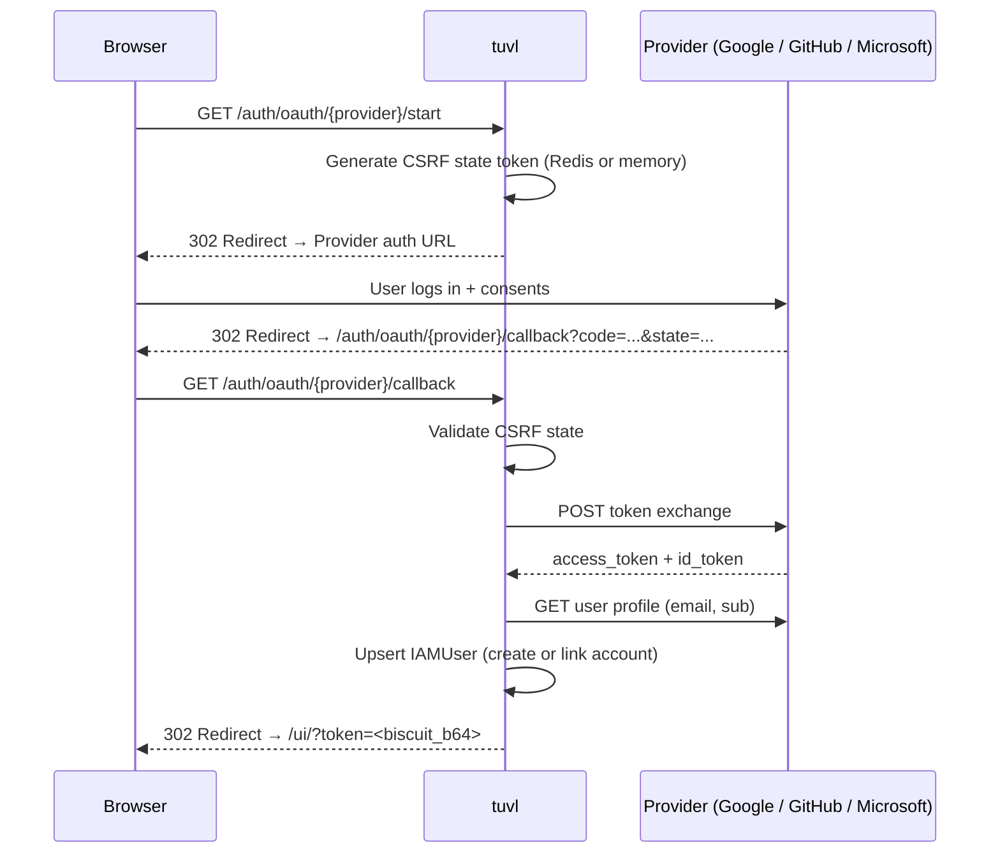

# Federated Login (OAuth2)

tuvl supports OAuth2 Authorization Code flow for Google, GitHub, and Microsoft (Entra ID).
Federation providers are configured as YAML files in the `federation/` directory and managed
via the **Federation** page in the tuvl UI.

---

## How It Works



CSRF state tokens are stored in Redis (when configured) or in-process memory. In multi-worker
deployments you **must** configure a Redis datasource to share state across workers.

---

## Provider Configuration

### File Layout

Each federation provider is a YAML file in `<project>/federation/`:

```
project/
└── federation/
    ├── google.yaml
    ├── github.yaml
    └── microsoft.yaml
```

### Google

```yaml title="federation/google.yaml"
kind: FederationProvider
version: v1
metadata:
  name: google
  description: Google OAuth2
enabled: true
spec:
  provider: google
  client_id: ${GOOGLE_CLIENT_ID}
  client_secret: ${GOOGLE_CLIENT_SECRET}
  scope: "openid email profile"
  # allowed_domains restricts login to specific Google Workspace domains
  # allowed_domains:
  #   - example.com
```

Environment variables:

```env
GOOGLE_CLIENT_ID=your-client-id.apps.googleusercontent.com
GOOGLE_CLIENT_SECRET=GOCSPX-...
```

Built-in OAuth2 URLs (no override needed):

| Setting | Value |
|---------|-------|
| auth_url | `https://accounts.google.com/o/oauth2/v2/auth` |
| token_url | `https://oauth2.googleapis.com/token` |
| userinfo_url | `https://www.googleapis.com/oauth2/v3/userinfo` |

**Google Cloud Console setup:**

1. Create a project at [console.cloud.google.com](https://console.cloud.google.com)
2. Enable the **People API** or **Google+ API**
3. Create an OAuth2 Client ID (Web Application)
4. Add `{TUVL_OAUTH_BASE_URL}/auth/oauth/google/callback` to Authorized Redirect URIs

---

### GitHub

```yaml title="federation/github.yaml"
kind: FederationProvider
version: v1
metadata:
  name: github
spec:
  provider: github
  client_id: ${GITHUB_CLIENT_ID}
  client_secret: ${GITHUB_CLIENT_SECRET}
  scope: "read:user user:email"
```

Environment variables:

```env
GITHUB_CLIENT_ID=Iv1.xxxxxxxxxxxx
GITHUB_CLIENT_SECRET=xxxxxxxxxxxx
```

!!! info "Private emails"
    If the user's GitHub email is set to private, tuvl automatically calls
    `GET https://api.github.com/user/emails` to find their primary verified address.

**GitHub App setup:**

1. Go to **Settings → Developer settings → OAuth Apps → New**
2. Set Homepage URL to your base URL
3. Set Authorization callback URL to `{TUVL_OAUTH_BASE_URL}/auth/oauth/github/callback`

---

### Microsoft (Entra ID)

```yaml title="federation/microsoft.yaml"
kind: FederationProvider
version: v1
metadata:
  name: microsoft
spec:
  provider: microsoft
  client_id: ${AZURE_CLIENT_ID}
  client_secret: ${AZURE_CLIENT_SECRET}
  scope: "openid email profile User.Read"
  tenant_id: ${AZURE_TENANT_ID:common}   # "common" allows any MS account
```

Environment variables:

```env
AZURE_CLIENT_ID=xxxxxxxx-xxxx-xxxx-xxxx-xxxxxxxxxxxx
AZURE_CLIENT_SECRET=your-secret
AZURE_TENANT_ID=your-tenant-id   # or "common" / "organizations" / "consumers"
```

**Azure Portal setup:**

1. Register an app in **Azure Active Directory → App registrations**
2. Under **Authentication**, add `{TUVL_OAUTH_BASE_URL}/auth/oauth/microsoft/callback` as a redirect URI
3. Add a client secret under **Certificates & secrets**
4. Set the required `tenant_id` (use `common` to allow any Microsoft account)

---

### Custom Provider

For any OpenID Connect-compatible provider, supply all URLs explicitly:

```yaml title="federation/okta.yaml"
kind: FederationProvider
version: v1
metadata:
  name: okta
spec:
  provider: custom
  client_id: ${OKTA_CLIENT_ID}
  client_secret: ${OKTA_CLIENT_SECRET}
  scope: "openid email profile"
  auth_url: https://{your-domain}.okta.com/oauth2/v1/authorize
  token_url: https://{your-domain}.okta.com/oauth2/v1/token
  userinfo_url: https://{your-domain}.okta.com/oauth2/v1/userinfo
```

---

## Required Environment Variable

```bash
TUVL_OAUTH_BASE_URL=https://your-tuvl-instance.example.com
```

This tells tuvl what base URL to use when constructing the redirect URI sent to the provider.
In local development set it to `http://localhost:8000`.

---

## Admin API

Federation provider files can be managed without filesystem access via the admin API.

!!! note
    All federation admin endpoints require the `iam:admin` scope.

### List Configured Providers

```http
GET /auth/admin/federation
Authorization: Bearer <admin_token>
```

Returns an array of provider names: `["google", "github"]`

### Get Provider Config

```http
GET /auth/admin/federation/{name}
Authorization: Bearer <admin_token>
```

Returns the raw YAML content (secrets are visible — use with care).

### Create / Update Provider

```http
PUT /auth/admin/federation/{name}
Authorization: Bearer <admin_token>
Content-Type: application/json
```

Accepts the YAML object as JSON. The file is saved to `<project>/federation/{name}.yaml`
and the registry is reloaded immediately.

### Delete Provider

```http
DELETE /auth/admin/federation/{name}
Authorization: Bearer <admin_token>
```

Removes the YAML file and un-registers the provider immediately (no restart needed).

---

## Account Linking

When a federated login succeeds, tuvl looks up a `iam_users` record by email:

1. **Found** — the existing account is reused. `federated_provider` and `federated_sub` are
   updated on the record if not already set.
2. **Not found** — a new user record is created with `is_active=true`. The account has no
   password (federated-only).

The returned Biscuit token carries whatever roles the user has been assigned in the database.
First-time federated users have no roles until an admin assigns them.

---

## Domain Restriction

Use `allowed_domains` to limit login to specific email domains:

```yaml
spec:
  provider: google
  client_id: ${GOOGLE_CLIENT_ID}
  client_secret: ${GOOGLE_CLIENT_SECRET}
  allowed_domains:
    - acme.com
    - acme.org
```

Users whose email domain is not in the list receive a `403 Forbidden` at the callback step.
Leave the field absent (or empty) to allow any domain.
