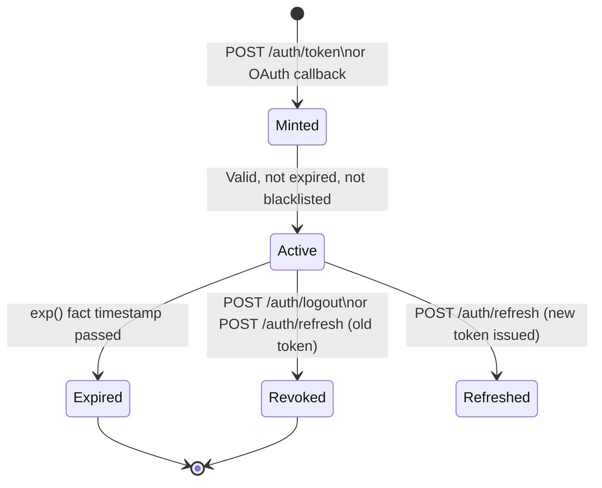

# Biscuit Tokens

tuvl uses [Biscuit](https://www.biscuitsec.org/) tokens for authentication and authorization.
Biscuit is an open standard for capability tokens — they are cryptographically signed, carry
Datalog facts (identity, roles, scopes, expiry), and cannot be forged or tampered with.

---

## Token Structure

Every tuvl Biscuit token contains an **authority block** with four kinds of Datalog facts:

```datalog
user("550e8400-e29b-41d4-a716-446655440000");  // user UUID
group("hr_manager");                            // role name(s)
scope("requisition:write");                     // permission scope(s)
scope("candidate:read");                        // multiple scopes allowed
exp(1747180800);                                // UNIX expiry timestamp (optional)
```

The token is signed with the server's Ed25519 private key and encoded as URL-safe Base64.
It is sent in every API request as an HTTP Bearer token:

```http
Authorization: Bearer <biscuit_b64>
```

---

## Token Lifecycle



---

## Token TTL

Tokens are minted with an embedded `exp({unix_ts})` fact. The default TTL is **86400 seconds
(24 hours)**. You can change it per deployment:

```env title=".env"
TUVL_TOKEN_TTL_SECONDS=3600   # 1 hour
```

Setting `TUVL_TOKEN_TTL_SECONDS=0` omits the expiry fact entirely. This is **not recommended
for production** — tokens without an expiry can only be invalidated by blacklisting.

When a request arrives with an expired token, tuvl returns:

```json
HTTP/1.1 401 Unauthorized
{"detail": "Token has expired."}
```

---

## Token Refresh

A client may request a new token before expiry using the refresh endpoint:

```bash
curl -X POST http://localhost:8000/auth/refresh \
  -H "Authorization: Bearer <current_token>"
```

The server:
1. Verifies the current token (must be valid and not expired)
2. Looks up the user in the database (must still be active)
3. Mints a new token with a fresh TTL
4. **Revokes the old token** by adding it to the blacklist

```json
{
  "access_token": "<new_biscuit_b64>",
  "token_type": "bearer"
}
```

---

## Token Revocation (Blacklist)

Explicit revocation is handled by a **token blacklist**. Revoked tokens are rejected
on every subsequent request, even before their `exp` timestamp is reached.

The blacklist stores the **SHA-256 hash** of each revoked token string — the raw token
value is never persisted.

### Storage backends

| Backend | When used | Scope |
|---------|-----------|-------|
| **Redis** | A `type: redis` datasource is configured | Shared across all workers |
| **In-process dict** | No Redis configured (fallback) | Single worker only |

!!! warning "Multi-worker deployments"
    Without Redis, a token revoked by one worker is still accepted by all other workers
    because each process has its own blacklist. Configure a Redis datasource before scaling
    to multiple workers or processes. See [Redis Configuration](../configuration/redis.md).

### Automatic TTL

When a token is blacklisted, the entry is stored with the token's remaining TTL (time until
its `exp` fact). Once the natural expiry passes, the blacklist entry is cleaned up
automatically. For tokens without an `exp` fact, a 24-hour fallback TTL is used.

---

## Signing Keys

tuvl tokens are signed with an **Ed25519** private key. The key lifecycle is handled by the
`TuvlKeyManager`:

### Persistent mode (recommended for production)

```env title=".env"
TUVL_BISCUIT_PRIVATE_KEY=<hex-encoded-ed25519-private-key>
```

Generate a key with the CLI:

```bash
tuvl keys generate            # prints the key and the .env line to paste
tuvl keys generate --write    # writes TUVL_BISCUIT_PRIVATE_KEY into the project .env
```

!!! warning "Required for `tuvl run`"
    Production mode fails closed if `TUVL_BISCUIT_PRIVATE_KEY` is not set — it will
    **not** fall back to an ephemeral key the way `tuvl dev` does. Generate and set the
    key before deploying. Keep it stable: rotating it invalidates every existing token.

??? note "Generate without the CLI"
    ```bash
    python3 -c "from biscuit_auth import KeyPair; print(KeyPair().private_key.to_bytes().hex())"
    ```

Store the hex string in your `.env` file or secrets manager.

### Ephemeral mode (development only)

If `TUVL_BISCUIT_PRIVATE_KEY` is not set:

- **Production mode** (`tuvl_dev_mode=false`, the default): the server **refuses to start**
  with a `RuntimeError`. This prevents accidentally running production without a stable key.
- **Dev mode** (`tuvl_dev_mode=true`, set by `tuvl dev`): a fresh random key is generated
  in memory. All tokens are invalidated on restart.

A warning is logged in dev mode:

```
⚠️  Auth: No TUVL_BISCUIT_PRIVATE_KEY found — using an EPHEMERAL key.
   All Biscuit tokens will be invalid after process restart.
```

---

## Security Guarantees

| Property | How it is achieved |
|----------|--------------------|
| **Integrity** | Ed25519 signature — any modification invalidates the token |
| **No server-side state** (normal) | Facts are self-contained in the authority block |
| **Expiry** | `exp({ts})` Datalog fact checked against `time.time()` on every request |
| **Revocation** | SHA-256 blacklist in Redis or in-process memory |
| **Scope injection prevention** | Scope/group values validated against `^[\w:.\-/]+$` before minting |

---

## Token Inspection

You can decode a Biscuit token for debugging (the signature is not verified client-side):

```bash
# Biscuit CLI (https://github.com/biscuit-auth/biscuit-cli)
biscuit inspect <token>
```

Or in Python:

```python
from biscuit_auth import Biscuit
from tuvl.core.auth.keys import key_manager

biscuit = Biscuit.from_base64(token, key_manager.public_key)
print(biscuit.authority_block())
```
